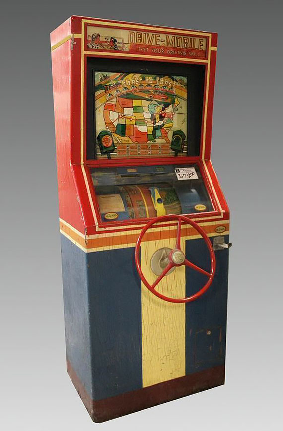
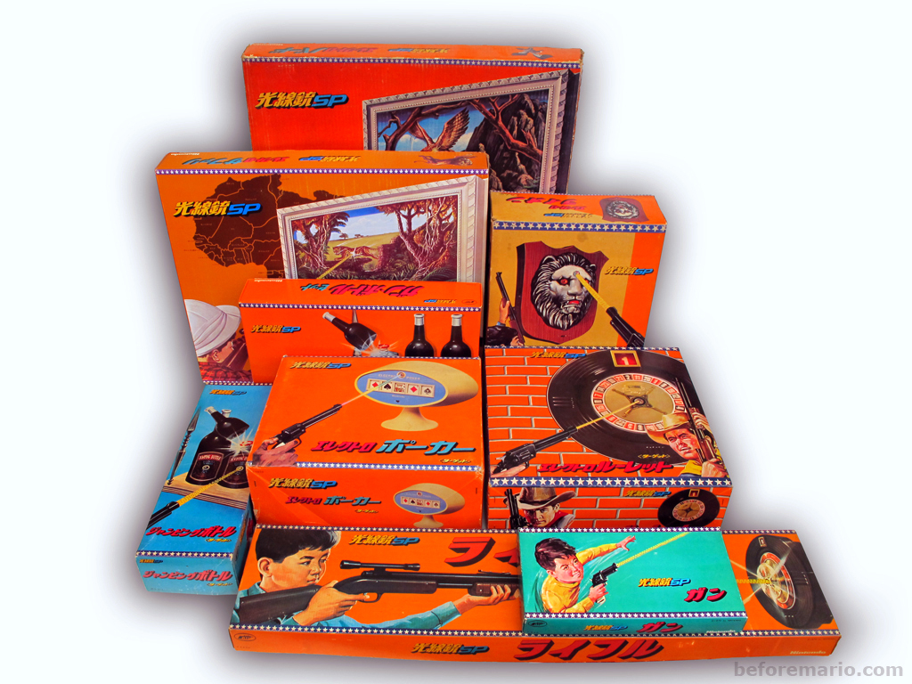
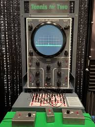
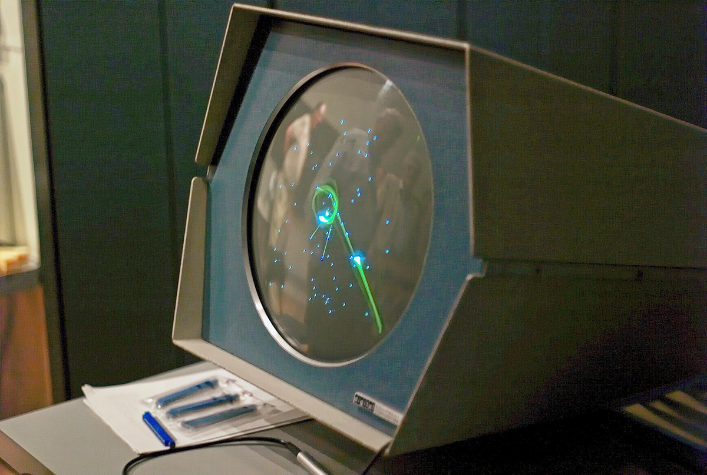
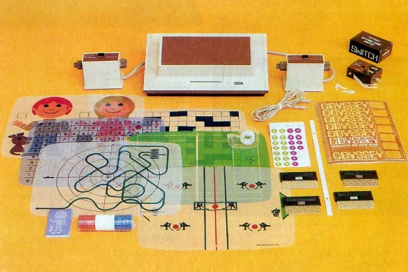
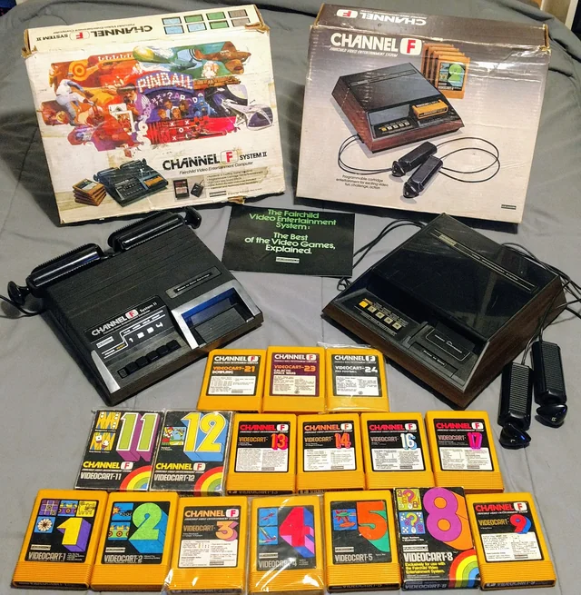
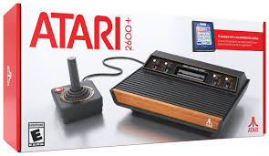

The Atari 2600 was a real mess. It's a good thing that we don't try to program machines like that anymore because it was just absurd. But it was kind of fun in a sick way if you like that kind of challenge.
	Howard Scott Warshaw, Atari 2600 game developer
	Creator of Yar's Revenge and E.T. the Extra-Terrestrial

---------------- Table of Contents ---------------- 

1. [Welcome](#welcome)
2. [The 2600 and its Legacy](#2600)
3. [Logistics](#logistics)
4. [Resources and Additional Spaces to Learn](#resources)
5. [TLDR](#tldr)
6. [Next Time](#nexttime)

---------------- Table of Contents ---------------- 

The Atari 2600 was released in 1977, 1 year before I was born. It existed as an active system up until around 1991 (5 years before I graduated high school). In 2023, the Atari 2600 got a new release for modern televisions - aptly named the Atari 2600+. Or in other words, a thing from my childhood is new again for folks who never got to play these now legendary games.

You can read about it's developer and development here: 
* [New Atlas Preview](https://newatlas.com/games/plaion-atari-2600-plus-console/)
* [CNN Mention](https://www.cnn.com/2023/09/30/tech/atari-2600-plus-wade-rosen-nintendo-playstation/index.html)
* [Games Radar](https://www.gamesradar.com/atari-2600-plus-review/)

But it's not like the Atari 2600 hasn't had an active development scene since the 80s. Learning about that [enthusiast community](https://atariage.com/), the company that birthed the video game console, and where all those employees went in the great crash in the 80s will teach us a lot about what we think video games are, how we've learned to make video games, and how we've learned to develop games. 

We owe Atari a ton; in fact, we owe the 2600 for just about everything (good and bad) from developers actually being named to crunch to 3rd party developers to innumerable facets of the video game industry that exist to this day. There are so many folks who owe their careers to Atari. We know some of them.

We could point to [Steve Jobs](https://www.youtube.com/watch?v=17eUExffa5w&ab_channel=GameInformer) getting his start in software development at Atari (really it was Woz but that's a long story). We could point to [Mark Cerny](https://www.youtube.com/watch?v=klPs3KrXiJE&t=1480s&ab_channel=GDC2025), the current Sony system architect, as employee 16,000 of Atari at the age of 17 where he would create Marble Madness and push the envelope of 3-D design. 

We have pornographic games, racist games, pirated games, games that reportedly destroyed the game industry, edugames, exercise games, and much, much more. 

It's a vast, complex ecosystem that has never truly stopped expanding. 

So, where do we begin? How? Why?

Over the course of the semester, i'll be bringing you through not only the history of Atari 2600 programming, but the language it used for development -- Assembly 6502. 

We will be "[racing the beam](https://www.youtube.com/embed/sJFnWZH5FXc?si=p-55AMiUwLfz8yM2)" all semester. So get ready!
# Welcome!!!!
Goal: Introduce a general history and the context of where and why we'll be creating games for this now live system. 

To begin, I think it's important to talk about the software of the console and their legacy. Some of what we tried when the video game idea was new has never been developed further. Other aspects of games have been overdeveloped. And so we're in a weird space with regard to the video game at the moment. Tech is stalling, games are stalling, everything is starting to feel stale, and so we have a reason to look backward. 

In this section, we''ll talk about the early attempts at games, early video game consoles, the legacy of the 2600, and games of note on the system. We'll even talk about a few recent games of note released within the past 5-10 years for the 2600. 
### Early Attempts at Games
The earliest video game many of us have been able to find is a game called Draughts (Checkers) in 1951 by [Christopher Strachy](https://historyofinformation.com/detail.php?entryid=3731). This game was written in 1951 but not fully run until 1952. It is a notable piece of technology because the origin of Machine Learning in the computer sciences are based in and around a [Checkers playing program from Arthur Samuel in 1959](http://incompleteideas.net/book/first/ebook/node109.html). While Samuel had been working on the concept for almost a decade at that point, it was in 59 that this game playing software or new attempt at what would become Game AI would appear. In other spaces, we'd see games here and there but most of them were parlor games or weird hybrids like light games like Drive-Mobile below. 

These electromechanical games are neat and you can make them at home still with a few sheets of paper and some sensors.

I should also note here that a certain important game company also got its start here. Nintendo's toy lines had evolved to include light gun technology similar to these early arcade games. This would become their entry into games soon after the popularity of this line: 

#### Tennis for Two (1958)
The Manhattan Project gave us the Atomic Bomb but almost immediately after using it, the sheer magnitude of what had been done began to weigh heavily on many. Spacewar! from William Higgenbotham was born out of the guilty associated with the bomb. This was not only one of the first video games, but was also a piece of software that used graphic displays, a novelty at the time. 

#### Spacewar! (1962)
Spacewar! has long been considered the first videogame though Higgenbotham's work is more recently being given recognition. Whereas Higgenbotham was working at Brookhaven, Spacewar!'s creators,  Steve Russell in collaboration with Martin Graetz, Wayne Wiitanen, Bob Saunders, Steve Piner, and a few others associated with the railroad club at MIT and a lab at Harvard, were all working at MIT. Much like the game Draughts, mentioned above, there were a variety of games that had been designed but had mostly been novelty games like Checkers or Tic-Tac-Toe. Notably, this game was [written in Assembly](https://www.masswerk.at/spacewar/sources/). 

#### Pong!
So, Pong! was a whole phenomenon. It was a shock to folks in the arcade business, primarily pinball at that time, that this simple collection of wires could generate so much revenue. This game offered a glimpse at what was about to happen with regard to the arcade movement. While this movement would crash and burn much like the home video game movement that started with the Magnavox Odyssey, it remains as a moment in time that we need to pay attention to for what it did do and what it neglected to do.

![[images/pong.png]]
A thing that I at least find fascinating for this game is that it has no software. It is a collection of wires and circuits without any sort of software at all. It's hard to wrap your head around this now but given the above light gun games, they were essentially combining the two spaces into extremely (what we at the time would call simple) complex ways. Alan Allcorn designed the initial prototype and then the Magnavox Odyssey would release it for their system followed quickly by Atari releasing newer versions of it, getting sued by Magnavox, and then pushing their engineers to disconnect from Pong entirely. 

So let's head to other spaces.
### Magnavox Odyssey
This is often considered the first console. It was kind of a weird thing in that it didn't use cartridges but you could use various sheets to shift the games around. It included a number of board game pieces that could be used with the games as there wasn't any logic stored in the console. It is notable for sort of standardizing the normal collection of objects we associate with video games such as detachable controllers, paddles, and light guns. The later, light guns, is important because an older company called Nintendo had formed a partnership with Magnavox to expand their toy production capacity via their carnival light gun games. This would be how Nintendo gets involved with the video game market.

At current, Magnavox (now Phillips Magnavox after its purchase in 1974 and then later would develop the laserdisc with Sony and then even later become a part of the company Raytheon) is mostly owned by a Japanese company called Funai but that company is in trouble.

### Fairchild Channel F
The Fairchild Channel F (F for fun!) was an important console to the history of games but one that got decimated by the popularity of the Atari 2600. It is a notable console as it contains: 
* origin of the video game cartridge.
* [first easter egg](https://www.youtube.com/watch?v=ws-ExrlbmtY)
* perhaps the first programmable game system (assembly language for the 6800 microprocessor)
* Also the first 8-bit processor but was quickly eclipsed and forgotten
If you get a chance, give the games a shot. It is a bit weird to see games with even fewer resources than a 2k game on the 2600 but it's also neat to see different computational approaches to interactive media.

Fairchild was owned by Lockheed Martin for a while until it was sold off to the Carlye Group when they were buying things before and during the tech bust in 2000. At the moment, the company doesn't really exist anymore but is considered property of BAE Systems, a defense contractor. You may wonder why so many of these companies end up in defense spaces and this is because of the origin of games from defense technologies. While they may have been born because of war and many games originating from the war gaming tabletop space via Dungeons and Dragons and Stat-o-matic games, their legacy has surprassed their violent origin. 

# The Atari 2600 and its Legacy
So, the Atari 2600 turns 50 this year. There's a whole lot of activity in and around the console. So much so that they sat down and re-released a new version of the console (the Atari 2600+) that can hook up to an HDMI signal. The only real tradeoffs are that instead of reading the game cart in real time, it dumps the ROM and reads it internally. It makes a more stable game experience but also makes the first failure to boot (so we gotta blow on the carts) take more time as it needs to load Stella to load the ROM it dumps. 

You can buy one if you like! They are around $130. 

So for many of you, you might have heard some myths and legends here and there. Ready Player One is probably a source for a lot of the current nuggets in culture at the moment. However, there's a rich legacy that we'll be digging into today as we learn how to make bits move around on the console. Let's talk about how the Atari got established, establish a high level overview of how it works, and then get into some specifics like the legacy it established in the game industry as a whole. We'll finish by talking about notable games and designers.
## Not the origin but where we started
So, the Atari 2600 is not the first game console, not the first video game, not the first game company, and is not the first at really...well, anything. However, it was the moment in time where the home game console moved from extremely expensive curiosity to novel, relatively cheap home entertainment system. 
### The General Loop
So how did this console work? Well, remember that back then we didn't have individual pixels we could color quickly. We had to wait for an electron beam to go across a screen and then go down. Additionally, we had to deal with very tiny amounts of space. All of these limits provided an endless array of possibility. If I were to call into being a metaphor for what the Atari was like, consider Vine before Tik Tok.

At its most basic, using terminology that should be familiar to you now, look at the picture below: 

This will be covered more in depth on the next time we meet. However, what we essentially have is a number of pixels to start processing as the electron beam starts at the upper left and slowly goes down to the bottom right. All of your programming with require a bit of mathing out clock cycles to beam positions to a final resolution of about 160x192. 

Are these pixels? Not really! It's a combination of scanlines, pixels, and computer cycles. Here's a brief glimpse of the specs you'll be working with. 

**Hardware:** 
* MOS 6507
	* the 8080, the 6502, and the 6507
	* This chip is still in use today and has powered everything from the NES to Tamagotchi, and more.
	* 1.19mhz processor
* Television Interface Adaptor (TIA): 
	* Technical development of the TIA took the most amount of time at 2 years. 
	* This chip was extremely unique at the time and sets the bar for how games would work very generally in how it sends signals and interprets them to and from the ROM and the TV.
* The 6532 or RIOT chip:
	* (R)am: 128 bytes, 16 (I/O) ports, and a programmable (T)imer
	* This is the thing that generally allows you to interact with the 6502 and send signals to the TIA.
* Cartridge:
	* 2k - 4k ROM
  
**Notes and Misc**
* Carts contain all ROM and Instructions for hardware.
* The system itself contains 3 chips (show schematic)
* The most interesting (maybe) thing about this system is how barebones it is. 
* There are no tuples for coordinates (x,y). Instead, you time drawing according to the beam's position.
	* These days, it's a bit easier with a variety improvements in the compiler.

Here, you won't have a system like Unity do things for you, you have to painstakingly *(and concisely)* write a game on your own (or with a team). I will be doing this with you.

And so, you may consider this system, this course, and this language old, backward, and weird but it's also withstood the test of time as the Atari 2600 is new again but unlike all new systems where we have to learn how things work and then build on it with custom libraries and development content, we here will be learning how to do *everything by hand*. And this is very unlike what these folks did. 
## What a video game even is
So, it's important here to note that when the 2600 was new, we didn't really know what games were for. This time period is absolutely fascinating because while we were moving around squares and circles of differing colors and sizes, sometimes in the vague shape of things, what a game actually was was sort of an unknown. 

Pong, and the early arcade games didn't have ROM or RAM, they used a ton of circuitry to run the game and slowly, RAM was opened up or ROM to store graphics while the hardware did the rest. Software most mostly non-existent. 

And so, with a programmable ROM in the form of a cartridge and enough RAM to store some of that logic, we had our first interactive system that had interchangeable media. While a lot of the early games were just Arcade Ports (bad arcade ports), the canvas was there to start building on. And build they did. 

Shooters, platformers, adventure games, point and click adventure games, and all sorts of other types of games found a home here. At its core though was a super interesting thing - Lopsided play or Asymmetry. Consider this quote from one of your textbooks.

This is a significant shift for games. At the time, nearly all games were based in and around symmetry (think Pong) or just 1 player. By making a game for 2-players at the same time, we had a moment where skill against players became just as possible as skill against yourself or an engine. 
## Credits for Designers
Warren Robinett, who wrote *Adventure* was irked by the fact that Atari wouldn't actually allow them to have credit for their creations. This was why he inserted his name deep in the code and then promptly quit Atari to go into a different tech industry. At the time, Atari execs told the game programmers that, "They were worth as much as the man on the assembly line who put the game into the cardboard box."

This would culminate in quite a few lawsuits and a crisis in the world of software development as the CEOs and business leaders tried to squash anything but the brand being responsible for games. In fact, much of the way you see credits for games now is owed to this fight. 

One of the most high profile moments due to this issue came with a gang of 4 developers: Bob Whitehead, David Crane, Larry Kaplan, and Alan Miller. These are the 4 original founders of the video game company *Activision*.
## Lawsuits, the founding of *Activision*, and 3rd party games
The history of tech is often a battlefield waged in courtrooms around the world. Lawfare is a sometimes dirty business but at least we can typically see the strategies and rhetoric involved. One such court case mostly focuses on a collection of 4 individuals getting fed up with Atari, leaving the company, and starting their own company. 

This resulted in Atari suing for breach of NDA but in court, Atari essentially lost and eventually settled out of court. This resulted in the birth of a small company called Activision which you may have heard of. Atari would also get into the lawfare game wherein once the NES was released, they reverse engineered the 10NES Chip (for a good read on 10NES and the birth of DRM, I suggest [this article](https://journals.sagepub.com/doi/10.1177/1555412010377319)). If you've ever heard of a company called *Tengen* then you may understand.

There's all manner of lawsuit to read about and each one will give you a far different picture of the what the game industry is and how it came to be that way. 
## Pipelines (and Crunch)
When the word technology came into the english language, it was originally a word imbued with cautionary tales in and around new types of labor. That cautionary tale was usurped by folks who decided that technical prowess was akin to cultural power and so the race to spread and make more complex the technological spaces became a sort of race, a sickness. Gone were the labor laws of the working classes in and around manufacturing. Instead, we saw a massive abuse of designers who themselves would gleefully be locked in a room and not allowed to leave until a problem was solved. 

This is the birth of crunch and it continues to this day. Take E.T. for example, this was a game where they *Absolutely Had To* get it out for Christmas but they didn't get the license to design the game until July and they asked Howard Scott Warshaw to get it out by September so it could hit shelves in November. That 5 weeks will become more important later in this course.
## Notable Games 
* **Yars Revenge** - Howard Scott Warshaw
	* Notable stationary shooter - think Shooter bosses.
* **Raiders of the Lost Ark** - Howard Scott Warshaw
	* Point and click adventure game
* **Breakout** - Steve Wozniak
	* This would form the basis of the Apple ]\[ 
* **Adventure** - Warren Robinette
	* Adventure game but also early action-RPG
* **River Raid** - Carol Shaw
	* Scrolling shooter, also a very important game in terms of women in computing. 
* **Pitfall** - David Crane
	* 255 Screens, procedurally generated rather than stationary. Made for a platformer type game that seemed nearly infinite. I didn't even know it was beatable until I started prepping for this course.
## Notable Designers
* Mark Cerny
	* Tell me who this is.
* Howard Scott Warshaw
	* See above games.
* Steve Jobs / Steve Wozniak
	* Tell me who this is.
* Chris Crawford
	* GDC creator, it was in his house the first time but he also did a ton of other things. 
* Eugene Jarvis
	* Defender
* Carol Shaw
	* River Raid
* Ed Logg
	* Tengen games (Gauntlet, Tetris, and others)

**Gang of 4** - Activision Creators
* Bob Whitehead
* David Crane 
* Larry Kaplan
* Alan Miller 
# Logistics - Ok, that's a lot, why this course?
I wrote this course for 3 reasons: 
1. I grew up with the Intellivision as my first console but have always been curious about the Atari.
2. I wanted to get into Assembly and Vintage Computing because of my actual work.
3. Teach another programming course that isn't python or anything practical.

I will warn you now that the course will be an intense dungeon but we'll try and structure it so it's not so time consuming. One thing to keep in mind is that we're going to go extremely slowly through the basics of how an Atari game works. At just 2-4KB, that's not a lot. 

So, grades and things. How will it work? The general loop of the course is this: 

**11 weeks - Instruction** in person
1. Read something - Usually chasing the beam, your textbook, and something else.
2. Watch something - Usually a post mortem (*these will never be required*)
3. Annotate a source file - from the 2600's past.
4. Write something - typically it'll be a brief response, a design doc, or a coding exercise. 

**5 weeks - Development** via Zoom
1. Make a game.
2. Check in with me.
## Resources and Additional Spaces to Learn
Assembly has been around for quite a long time now and it's been active for ages. You've probably used something that was written in Assembly and for the 6502 over the years if you've ever: 
* Touched an NES
* Touched a Commodore product
* Played with a tomogatchi
* Played with the Atari Lynx.

The chip (MOS 6502) is also in the [hall of fame of chips](https://spectrum.ieee.org/chip-hall-of-fame-mos-technology-6502-microprocessor/particle-7#:~:text=6502%20Micro%2Dprocessor&text=The%20chip%2C%20and%20its%20variants,known%20as%20the%20Atari%20VCS)).

I've used and collected a number of resources for this course. I'll put a bunch here and a bunch more in the MyCourses instance.

**Courses:** 
* [Pikuma 6502 course](https://pikuma.com/courses/learn-assembly-language-programming-atari-2600-games)

**Self-Study**
* [8-Bit Workshop](https://8bitworkshop.com/)
	* this is where our textbook comes from and our in-class IDE. I'll provide some instructions on other ways to develop as needed. 
	* There is a [neat amount of documentation on 8bit workshop as well](https://8bitworkshop.com/docs/platforms/vcs/index.html)
* [Visual 6502](http://www.visual6502.org/)
	* Note in the above that the Atari uses the 6507 chip but still can use pretty much everything here. 
* [Easy 6502](https://skilldrick.github.io/easy6502/#first-program)
	* This is a super neat visualization engine of Assembly. It's sort of like Python Anywhere but for Assembly and will be useful at times. 
* [8Blit Atari 2600 Programming](https://www.youtube.com/@8Blit/playlists)
	* 8Blit is simply amazing. So many easy to understand tutorials and approaches to the work.

**Ephemera and Atari Stuff**
* https://www.atarimania.com/list_ads_atari_page-_1-_2.html
	* Ephemera and collected wisdom about the Atari over time. It's neat to see ads and things from when it was new.x`

**Sample Code and Alt Projects**
* Snake in Assembly: https://gist.github.com/wkjagt/9043907

**Videos**
* [28c3: The Atari 2600 Video Computer System: The Ultimate Talk](https://www.youtube.com/watch?v=qvpwf50a48E&ab_channel=28c3)
* [27c3: Reverse Engineering the MOS 6502 CPU (en)](https://www.youtube.com/watch?v=fWqBmmPQP40&t=1926s&ab_channel=Christiaan008)
* [Atari 2600 Programming is a Nightmare](https://www.youtube.com/watch?v=-l18Rwbinp8&ab_channel=Truttle1)
* [Making Labels for 2600 Games](https://www.youtube.com/watch?v=-bbGbGVC6FY&ab_channel=MarkFixesStuff)
* [Burning EEPROMS for the 2600](https://www.youtube.com/watch?v=77PMlBhEHFw&t=1183s&ab_channel=ArtifactElectronics)
* [Hello World on an Atari? Not Easy!](https://www.youtube.com/watch?v=iyzehlHJZ7w&t=877s&ab_channel=TheRetroDesk)
	* This video gets a bit into Batari Basic so it won't be covered in class but if this is something you're interested in, have at it.
* [Racing the Beam Explained - Atari 2600 CPU vs. CRT Television](https://www.youtube.com/watch?v=sJFnWZH5FXc&t=441s&ab_channel=RetroGameMechanicsExplained)
# TLDR
Old machine is old, but it contains all the building blocks we still use in the industry to this day. While it has extreme limitations (4k bytes of memory total (which can be augmented with memory banking but we'll not cover that in this course)), that limitation is reinforced by being able to interact with the hardware as directly as possible. As such, programming for this newly re-released system can show you on a very intimate level how your code and the hardware interact.

Another reason this is useful is that the video game industry had to learn how to make games, D&D existed but was not incorporated immediately into the world of games in the home arcades because of the limitations.

Over the course, we will learn about the games, their history, and more.
# Next Time
We'll talk about the technical nature of the Atari 2600 and just how ~~little~~ much you'll be working with. Be prepared to be amazed!
