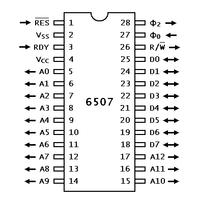

---------------- Table of Contents ---------------- 

1. [Welcome](#welcome)
2. [Logistics](#logistics)
3. [TLDR](#tldr)
4. [Day 1](#day1)
5. [Day 2](#day2)

---------------- Table of Contents ---------------- 
# Day 2 - Tech Specs and More

So, we're going to be working mostly in the world of Assembly as it is in the present. We're going to be working with exactly 4k space on carts. You can do more but i'll leave that with you as the Atari existed at least 4 years until memory banking was figured out. 

The general outline of this particular talk is as follows:

1. What is the resolution?
2. How does a cart work with the Atari?
3. What is the mental model for how programming on this thing works?

## Resolution 

But it's not just pixels, we're actually unable to positions things using concepts like tuples. Instead, we have to think about the mechanics of a CRT. For example, you have to think about it like this: 
* pixels exist and you might use them in your design. In fact, you kind of have to. In this case, we can say that there are 160 pixels across and 192 pixels down. 
* Only, to get things onto the screen, we have to 

Chipset and hardware

Here is where things get funky. Atari didn't want to pay for the full 6502, they wanted to strip it down and make it even cheaper. With the help of the Intel 8080 and MOS6502 developer Chuck Pebble, they came up with the 6507. 
 

The result was a price point that could get this box into the homes of everyone. 

Next week: The elements of the screen, IDEs, and Getting Started - pipeline and experimentation, other places to practice.

Week 03 - Hello World
