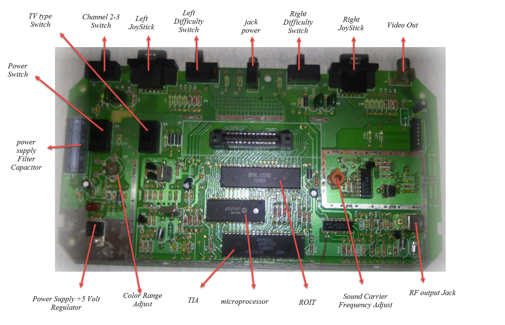
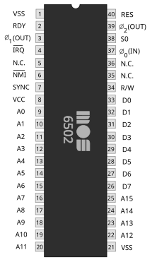
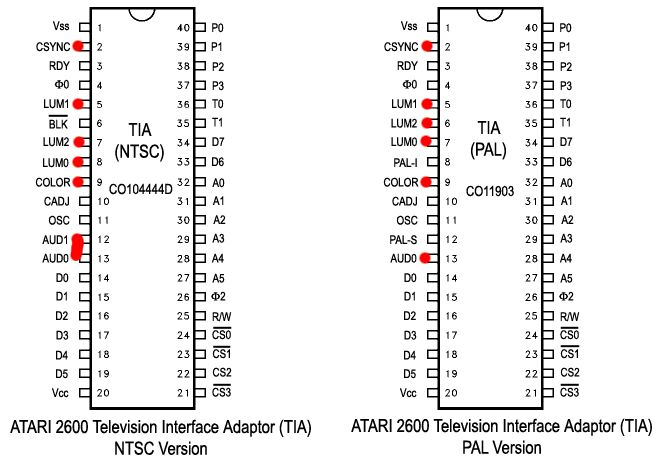
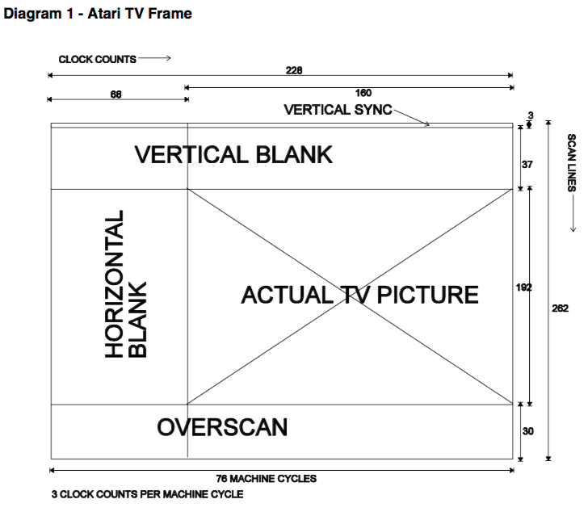

---------------- Table of Contents ---------------- 

1. [Day 2 - Tech Specs and More](#day2)
	1. [On Bankswitching](#banks)
	2. [Resolution](#res)
	3. [On Racing the Beam](#onracing)
2. [Logistics](#logistics)
3. [TLDR](#tldr)
4. [Day 1](#day1)
5. [Day 2](#day2)

---------------- Table of Contents ---------------- 
Before we get into the technology we'll be working with, I wanted to take some time to talk about the directionality of tech. We tend to use terms that imply direction with regard to technology; for example, progressed, advanced, cutting edge, and more.

While these terms imply "new," they don't really do much for us outside of knowing that there's something new and there always will be as the word design can also be replaced with criticism. After all, if things were newer and therefore better, we wouldn't be constantly striving for some new, new thing.

And so, this is a course reserved for something that is neither cutting edge, nor new. As we move through the communities around this space, you'll hear words like "primitive" or "antiquated." These terms are true for more than just the tech in that video games themselves were new and having a joystick + button is kind of limiting.

However, the 2600 was just re-released. It is a new console. The 6502 chip is still an active and near omni-present force in technologies. We have seen it in all manner of device and will continue to see those things in new devices. As such, it is important here to say that this course expressly stands against this constant seeking of new in service to some direction. Instead, this course stands in testament that for every new bleeding edge, there are innumerable past edges that are still bleeding, if not scabbed over or infected.

Tech is constantly changing, not advancing or heading somewhere. Sometimes we have to stop and deal with the reality of things, not the market of things. So, be mindful of your mindset as it can close doors to you, or open more than you might know of now.
# Day 2 - Tech Specs and More
Today we will spend a bunch of time talking about the tech specs of the Atari 2600. While this often does not matter for our courses here in GCCIS, we'll be directly interfacing with the hardware (know emulated software). A lot of what we'll be doing isn't dictating what part of a cartesian graph to illuminate with sprites or graphics, but telling an electron beam travelling across the screen when to show certain kinds of pixels. Much of this will be in binary though at times we'll be using hexadecimal or literal numbers.

We must prepare ourselves for this journey then, so we'll be concentrating on the chipset inside the original 2600. To that end, take a look. We'll show you a picture of the board, a diagram of the board, and mention the old issues around NTSC and PAL: 

So, we have a lot going on here. The power supply does what it does, that much should make logical sense. However, we then have a bunch of switches ranging from dictating channel, joystick inputs, difficulty switches, video out, and the ROM/Cartridge reader. 

But then we have things like the Microprocessor, RIOT, TIA, Sound adjustors, and color adjustors. What do those do?

* 6507
	* This is the processor for the Atari itself. It is based, as the name of the language might imply, on the 6502 Processor. Chuck Pebble, who designed the original 6502 chip for Motorola, went to a new company called MOS and redesigned the chip and tried to make it cheaper. The 6507 was an even cheaper version of the chip and came it at around $20 per chip. This decreased the price point of the console by quite a lot.
		* The 6507 compared to the 6502 checklist: 

28 pins instead of 40

 

Price point comparisons (at the time of release)
* the 6502 was $25 a chip. This was too expensive, and so Chuck Pebble designed the 6507 and paired it with the 6532 (RIOT chip) at $12 dollars a piece. 
* This resulted in a console that cost around $150.00. 
	* Atari lost a little per console but as there were no 3rd party games, all their games were in house and their cost would make up the loss.
* 6532/RIOT
	* This stands for "RAM" + I/O or input/output + Timer. 
		* RAM = 128 bytes of RAM
		* I/O = 2 (1 for switches, 1 for controllers)
		* Timer
* TIA - Television Interface Adaptor

That is a pretty in depth overview. Let's take a bit of a lower level look at the physical aspects of the chips. Here is a list of specs we'll be working on and expanding on: 

* Processor Speed = 1.19mhz
	* Registers:
		* A = accumulator (8-bit)
		* X = index register (8-bit)
		* Y = index register (8-bit)
		* PC = Program Counter (16 bit)
		* SP = Stack Pointer (8-bit) but is slightly offset 
		* ST = Processor Status (8-bit)
* ROM (This is your cartridge) = 4kb (it is possible to do 8k but we won't in this course) and it contains the game logic, graphics, and kernal instructions
* TIA = Television Interface Adaptor
	* Jay Miner designed it. This thing took the most amount of time to design for the 2600. What it does is essentially communicate with the television and will dictate things like collision, output the input from controllers, and produce sound. 
* RIOT was covered above but here it is again:
		This stands for "RAM" + I/O or input/output + Timer. 
			* RAM = 128 bytes of RAM
			* I/O = 2 (1 for switches, 1 for controllers)
			* Timer

### On Racing the Beam
Finally, I want to note something with regard to the book we'll be reading here, "Racing the Beam." This refers to the literal way the Atari 2600 assembles the pieces above. 

Unlike many of the pieces of software we make today for televisions now where we draw graphics frame by frame using the frame buffer, the Atari 2600 didn't have access to that because it wouldn't be developed until slightly after the 2600's release. You can read about it on the [wikipedia page about Framebuffers](https://en.wikipedia.org/wiki/Framebuffer#:~:text=In%20the%20early%201970s%2C%20the,framebuffers%20capable%20of%20holding%20a). 

As a result, they didn't have things like sprite sheets or ways to call up preformed graphics. This is slightly inverse to arcade gaming where memory was often used to supplement hardware through storing bitmaps and recalling them as needed. Game carts being the ROM of the system would be developed and developed through subsequent generations of game console with no one console being any more or less developed than the past gen.

The result is that a screen is drawn line by line. To save memory, if nothing is changed, the next line is drawn like the one before it. This means there also aren't any X,Y coordinate systems as there are no registers for Y-components. We simply wait until the electron beam gets there. 

To give you a better example, here's a fun animation:

As a result, a designer has to design a game around the idea that you need to tell the TIA what to show each line while it is actually creating that line. 

This is called "Racing the beam" and is the general reason that programming for the 2600 is obtuse and complicated.
#### On Bankswitching
So, we're going to be working mostly in the world of Assembly as it is in the present. We're going to be working with exactly 4k space on carts. You can do more but i'll leave that with you as the Atari existed at least 4 years until memory banking was figured out. Rather than do the most complex stuff first, we'll be talking and working on exactly 4k of space (as opposed to the original 2k for *Combat*). If you want to explore bankswitching and get yourself somewhere in the vicinity of the 64k the 6502 was capable of, you're welcome to (but outside of class as I will not support it).

In class, i'll go through what this means but if you're reading this, check out Pac Man's original port vs 4k and 8k versions. While we didn't really know what a video game was when the 2600 came out, we have done a ton of refinements over the years to extend that.

Let's take a bit more inventory of what we'll be working with in a way that most game makers will be used to: 
## Resolution 

What do these terms mean?
* Clock Counts - this mostly means how many cycles your processor can have per scanline. In this case, we have 76 cycles per scanline which can be found via: 
	* 76 cycles per scanline. There are around 262 scanlines per frame. If we calculate this directly, we can get to our mitigating hardware limitation (processor speed). This means that 76 cycles * 262 total scanlines = around 19912 cycles per frame. If we then multiply that by the NTSC frame rate of 59.94Hz you get … 1193525.28.
* Vertical Sync - VSYNC or wait for the next scanline.
* Vertical Blank - VBLANK or black out the scanline.
* Horizontal Blank - I can't say it better than [this thread](https://www.vbforums.com/showthread.php?834017-Atari-2600-Programming-Tutorial-2-Your-First-Atari-Program-(Background-Demo)#:~:text=Each%20scanline%20consists%20of%20at,a%20Horizontal%20Blank%20or%20HBLANK.) but basically, this is accounting for the difference between processor and electron beam.
* Actual TV Picture - 
* Overscan - Mostly this was a feature of older CRTs and meant to align picture. Because no frame buffer, they had to deal with this manually.
* Scanlines - Electron beam goes from upper left to bottom right constantly. 

And so that's the screen of the machine. There are also reservations and dictated memory allocations for certain things. For example: 

* Background color. * 2 player sprites (8 bit), each with its own color
* Playfield with own color 
* 2 missile sprites (1 bit), re-using player colors
* 1 ball sprite (1 bit), re-using playfield color

**Next week:** The elements of the screen, IDEs, and Getting Started - pipeline and experimentation, other places to practice.