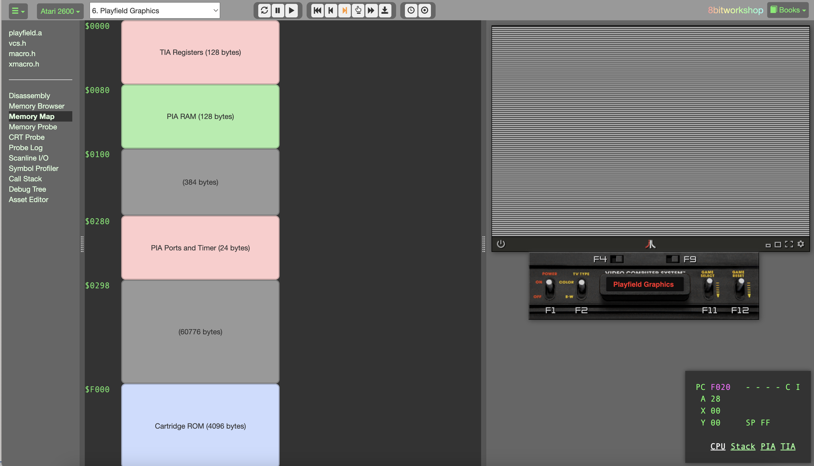
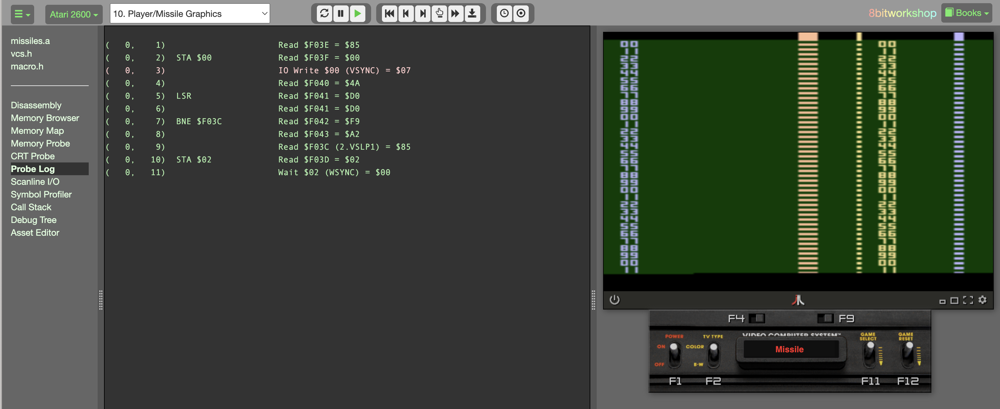
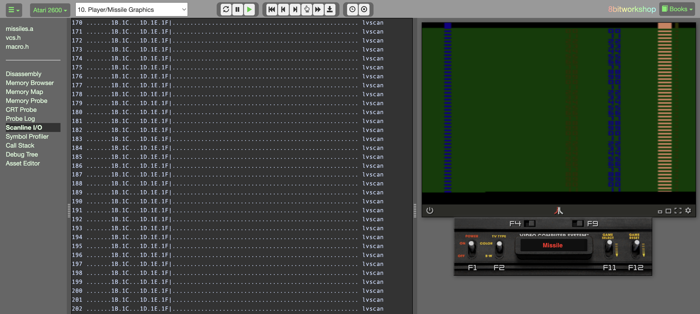
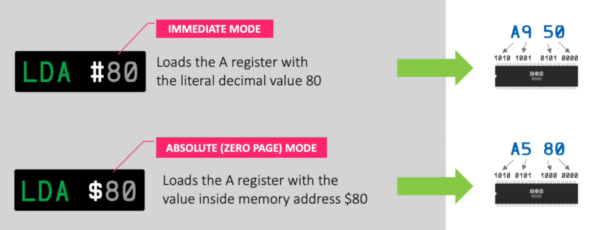
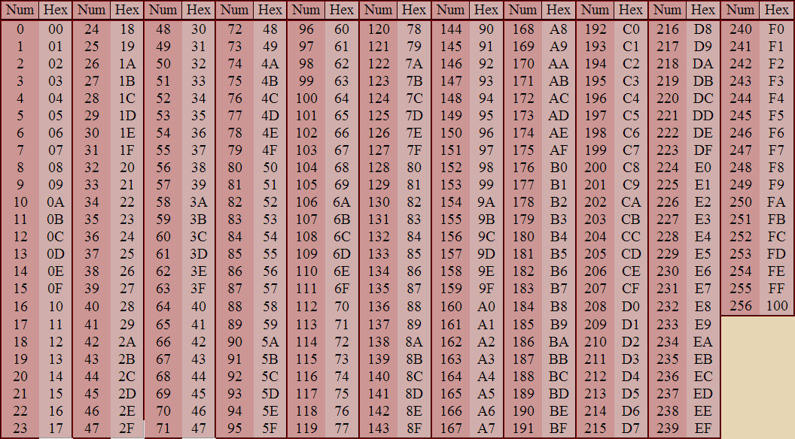

---------------- Table of Contents ---------------- 

1. [Intro](#intro)
2. [Assignments](#assignments)
3. [Links, Bits, and Bobs](#links)
4. [IDE and More](#idem)
	1. [Stella](#stella)
	2. [8-Bit Workshop](#8bws)
5. [Modes](#modes)
	1. [Signed vs Unsigned](#signun)
6. [Terms](#terms)
7. [OpCodes](#opcodes)

---------------- Table of Contents ---------------- 
# Introduction
So we're writing code for a 50 year old console that is 4kb at most without memory banking. How hard can it be? Well, instead of writing game logic for a translator or compiler, we're essentially writing machine code directly to a chip set. This means that you're going to have to translate your game loop for the limits and then translate your translation for Assembly. You can also read the actual machine language should you wish.

It is a very weird way to code at the beginning. Structured programming allowing for things like stable programming languages wouldn't come until a bit later. And so, we're talking about the wild west here. Going back to this is a little awkward and even a bit maddening because there are no helpers

IDEs and Ways to Code help us with our work. Televisions are no longer something to write around, but are automatically included as a coordinate system. Everything we make now is infinitely easier unless we're writing something like Dwarf Fortress or some game that pushes the limits of logic.

We use the phrase **Racing the Beam** a lot and I know i've mentioned it a few times but it will matter here moving forward. The easiest way to talk about this is the basics of coding: 

	The basic idea of making an Atari game is that for each scanline from the top left to bottom right, we have to configure the Television Interface Adaptor or TIA registers for each object JUST before the beam reaches its intended position.

So we will be using an IDE that has a built in Assembler that attempts to assemble every time you type. Because the Assembler is so tiny, we can use it like an interpreter (e.g. Python or Lua).  In addition, we'll be working just on the 2600 but Assembly 6502 is used by the Intellivision, Tamagotchi, NES, and more. It is just a matter of figuring out the structure to use.

We're going to take a bit of a tour of tools now. Each of these pieces of technology are open source and free given just how long ago this console was live. They are all also mostly developed through the help and guidance of reserved words, built-in functions, and more. In Assembly, we have some of those things since it was the first language to simplify machine language, but we've built so much on that foundation. 

If you'd like more of a history, head over here: https://archive.org/details/programsforelect00wilk or https://en.wikipedia.org/wiki/Assembly_language. we still use some Assembly in all software but it's small these days compared to what we're about to do. I hope y'all are ready to glimpse history and do some writing with it. 

So let's take a tour. 
# Assignments
It's week 2 so we're beginning assignments. The first assignment is that of simply reading. We will be reading the first 2 chapters of Racing the Beam as well as Chapter 1 of your main textbook. 

You might ask, "WHY?1? GOD I HATE READING." And you've answered your own question. STEM students tend to eschew reading while those in the humanities try to carry humanity's knowledge forward with fewer and fewer resources. This is a course that is applied history. It contains a lot of ways of thinking that do not exist anymore. It contains a lot of ways of designing that do not exist anymore. As a result, we have to read about them to glimpse at those things. 

Now,. i've asked for, "500 words" but this is just a number. If you write to the number, it's a pointless exercise. i'm asking you to learn, not asking you to scratch 500 words for fun. Bbut still, you all are trained to think in terms of doing *exactly* what I ask. So in that vein, what am I actually looking for?

Well, this first assignment has you reading *Racing the Beam* about Stella (the Atari 2600's development codename) and Combat. It's about 42 pages and should take anyone around 30 minutes or so. 

With the Hugg book, this is a series of exercises and content that should help you with reference material when you're actually working. I've tried to arrange the class around the topics in this textbook. 

An example response is this. I just wrote it and it is very stream of consciousness: 

	I grew up in a home that mostly leaned in to video games. It was the 80s though, so my exposure to games was first a Magnavox pong machine we had for a tiny black and white television. We played Pong for hours, days, all the time. It is a weird thing to be able to do that at home. We had an arcade at the mall but we weren’t allowed to go because it the was early 80s and arcades were places of ill reupute at that point.
	
	In reading this, I’ve been astounded by just how much work went into this machine. Beginning with the pinball industry and building on this was super interesting. I’ve seen the Spacewar machine at the Strong and I’ve played it a few times over the years in Arcades. It’s also fascinating to see just how much of an impact what Atari did had on games as a whole.
	
	One aspect of this console is that we see it now as primitive, as terrible, and yet in reading it, the idea that 128 bytes of RAM and 2k of ROM, later expanded to 4k is interesting when the Fairchild Channel F or Magnavox Odyssey are less than half the power of this behemoth. I’m also interested in the development of the RIOT chip and wonder just how much finagling happens with chipsets like they did with the 8080/6502/6507.
	
	I also love that I can buy a 6502 on Amazon for about $10-15 dollars or 6507 chips for even less. It is an enduring legacy for a chip to be used constantly for decades when the 486 infrastructure is harder to find. I am anxious to dig into this more.
	
	With regard to Combat, I have long been curious about the relationship between War and Video Games. We owe a lot of gaming to the machinery of war. To see this laid bare in Combat being the archetype for all other games on the system is certainly fascinating. More than that though, there’s some interesting consequences of bringing games home. On a single screen, you have the possibility of 2 people playing against each other in a symmetrical space, this was simple with pong or tennis for 2. However, it was more difficult at the time since the basis of a lot of arcade games was pinball games.
	
	Score attack is a constant feature of pinball and it wasn’t a surprise to see it in early video games. To see Combat become a prototype for what the Atari could do while simultaneously providing a canvas for what video games could be is fascinating.

It is more for you, than me. I want to force you to read and this is how I can do that. My apologies.

Let's take a moment to find things we can play.
# Links, Bits, and Bobs
One thing I should cover is where to find games. Most of the 2600 games have been mostly sourced out or otherwise covered. There's some ROMS, manuals and things. 

* Games: [Use Archive to find games, manuals, and more.](https://archive.org/details/Atari2600FullRomCollectionReuploadByDataghost "https://archive.org/details/Atari2600FullRomCollectionReuploadByDataghost")
* Homebrew: [Atari Age has a variety of collections.](https://forums.atariage.com/topic/144662-atari-2600-hacks-and-homebrews-rom-collection-v12/)
* Manuals: https://atariage.com/system_items.php?SystemID=2600&itemTypeID=MANUAL 
* Big ole PDF of all manuals: http://www.westg8.com/atari.html

Also, I need to include this in more markdown files but here are some templates: 

* Fonts for Atari: https://www.atariage.com/2600/archives/AtariFonts/index.html?SystemID=2600
* Label Maker: https://www.labelmaker2600.com/
* Manual dimensions: https://forums.atariage.com/topic/300644-homebrew-manuals/

We'll talk more about the art required for the carts, manuals, and boxes in the near future. With that said, let's head in to the IDE and operating environment. 
# IDEs and More

## Stella
Stella is an emulator that uses the same codename of the 2600 or VCS when it was in development. The emulator has been open source for quite some time so you can edit it, debug it, and view the source code as you see fit. Here are the links you need for Stella: 

* Main Website: https://stella-emu.github.io/
* Source Code: https://github.com/stella-emu/stella
* User Guide: https://stella-emu.github.io/docs/index.html

Stella Debugger - https://stella-emu.github.io/docs/debugger.html

**Upper Right** = RAM + location of the scan line and what cycle it's on. This is important as all your registers are there (PC, SP, A, X, Y, PS) and what is currently in them. We'll talk more about them when we get into [[Process Flags]] and [[Registers]]. In the case of the PS line, this is [Processor Status](http://www.6502.org/users/obelisk/6502/registers.html). We'll get into those soon but know CAPS = Negative, lower case = Positive.
PC = Program Counter
SP = Stack Pointer or the thing that points to the memory positions. 
A = Accumulator
X/Y = Registers

**Upper Left** = Current position of the scanline.

**Lower Right** = Disassembly or what is being stored everywhere. Not that at the start, we disable interrupts (sei) and then define the code origin, followed by then disabling the HCD decimal math mode, load X with a register, then send it to the stack pointer. You can walk through this with the "STEP" on the upper right. 

**Lower left** = your log but also you can  look at the TIA chip as well as the RIOT and Audio portions of your machine.

Red also means something changed whereas remaining white means it did not.

The more important thing, or perhaps the thing that is often missing in literally all CS stuff. In the lower right, we see a solid line followed by 78, d8, a2 ff. This is the "Op Code" or actual machine language.

One thing to note about how this debugger works. Mostly, we'll work backward as we begin at 0 and work up to maximum. So, look at the RAM and how the lower right is FF whereas the upper left is 08. 

Original Stella development guide is at: https://atarihq.com/danb/files/stella.pdf.

The above document is a retyped version of the original.
## 8-Bit Workshop
We're going to be using [8-bit Workshop's IDE](https://8bitworkshop.com/v3.11.0/) for a lot of in-class demos and work so I don't have to figure out the legality of installing Stella or any of the other emulators for the Atari. It has everything you'll need to write, compile, and debug your code. It also has a variety of amazing features like Github Integration as well as being an IDE for just about all older systems including early Computers like the Apple ]\[+  and Commodore 64. So, it can be of use elsewhere which is something i'll try and make sure we do with most of our tools.

I'm going to go through the IDE and the various tools that are available to us. For documentation, please refer to Hugg's growing documentation page: https://8bitworkshop.com/docs/docs.html
### Github Integration
Speaking of, there is an enormous amount of content for the Atari 2600 on Github. As you get your games going, I will ask you to submit public Github links that give me your current codebase. 

This course is also available for you to fork via Github so you can have the content you need. Our IDE, [8-bit Workshop](https://8bitworkshop.com/v3.11.0/) allows you to push everything you do to a private scratch space. Just follow the directions by clicking the hamburger menu and then go here: 

And it will walk you through everything you need. In this way, you can work on the code in your editor of choice, push and pull and publish as needed. Learning how to do this stuff is important as file maintenance is a very necessary skill for all game development projects and you can't just rely on a different IDE like Unity or Unreal to do it for you. 

### User Interface
Let's walk through this user interface. We'll situate it below: 

So, let's take a tour from the top line and then Left to Right. 

Menus and tools available to view. You'll see on the top bard what file you're working on followed by a number of "step" or "run to here" buttons. These are much the same as those of Stella. Below that, you'll see a list of files being used in the current file (dependencies as well as the actual file you're using). We will constantly use VCS.h and macro.h as they help provide some useful context for us in the modern era. 

To the right of the files and tools, you'll see Program Lines as well as the main coding window. Here, you'll see the line and if anything is happening in it with regard to machine code and the memory being invoked. As we get more familiar with OpCodes, this should become a bit more readable and can provide some valuable quick debugging. 

To the right of that is our actual render. Right now, i've got a simple "Hello World" invoked here. We'll slowly disconnect this and make it start falling around the screen but we have to do some coding exercises first.

Let's take a tour of the debugging tools next. 
### Disassembly

From the documentation, we learned that this tool, "Disassembles the program at the current Program Counter." But what does that mean?
### Memory Browser

From the documentation, we learned that this tool, "Displays a dump of all CPU memory." But what does that mean?
### Memory Map

From the documentation, we learned that this tool, "Displays a handy memory map of the system. Certain tools (like linkers) will give additional segment info here.." But what does that mean?
### Memory Probe

From the documentation, we learned that this tool, "Shows a bitmap representing read/write activity across system memory" But what does that mean?
### CRT Probe

From the documentation, we learned that this tool, "Like the Memory Probe, but follows the sweep of the electron beam (for raster displays)" But what does that mean?
### Probe Log

From the documentation, we learned that this tool, "Shows a textual log of CPU/memory activity." But what does that mean?
### Scanline I/O

From the documentation, we learned that this tool, "Like the Memory Probe, but follows the sweep of the electron beam (for raster displays)" But what does that mean?
### Symbol Profiler

From the documentation, we learned that this tool, "Shows a list of symbols, with read/write counts." But what does that mean?
### Asset Editor

From the documentation, we learned that this tool, "Parses assets (like bitmaps and palettes) and allows editing." But what does that mean?

We won't use this a lot as we don't actually have assets to manage. However, it will sometimes show the memory allocation of named entities like missiles and balls that we'll be able to adjust manually. Over time, we might end up coming back to this depending on if I can figure out how to force assets to end up there.
# Modes
For the most part, we're going to have to be able to move from literal to memory addresses to hexadecimal to binary all the time. We'll also sometimes work with machine code, especially when we're debugging. 

As a result, we need to get intimately aware of how all of that functions within our particular game. There are 3 distinct modes: 

We can also use literal hexadecimal as well. For example, what is: `LDA #$80`? 

This requires us to have understood what number we're looking for. We can use a chart to answer this this:

While this chart is useful, you can always keep this tab open in your browser for easier reference: https://www.rapidtables.com/convert/number/hex-to-decimal.html.
### Signed vs Unsigned Bytes
On page 3 of the Hugg book, you'll see a discussion of signed vs unsigned bytes or positive vs negative numbers. For the moment, we're going to assume that all values are unsigned but at some point, we're going to have to get into the two's compliment space.
# Terms to Remember
At the end of each file, I intend to place a relevant list of things to remember, terms to note. We will begin them here. 

1. **6502/8080**:
2. **6507**:
3. **6532/RIOT**:
4. **TIA**:
5. PIA:
6. DASM:
7. **Stella**:
8. **Condition Flags**:
9. **Scanline**:
10. 
# OpCodes
Over the course of this class, we'll be talking about OpCodes or precursors to things like Reserved Words or Built-in Functions (e.g. print(), etc.)

Rather than list them out, i'll include this section in our various daily notes, links to OpCodes:  
* https://www.atarimax.com/jindroush.atari.org/aopc.html
* https://www.atariarchives.org/creativeatari/Display_List_Opcodes.php
* https://user.xmission.com/~trevin/atari/6502_insn_set.html
* https://www.masswerk.at/6502/6502_instruction_set.html

