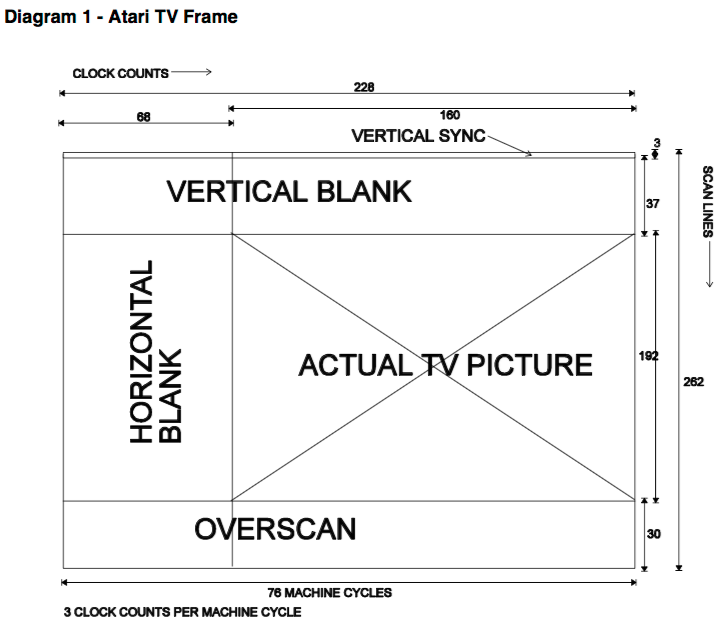
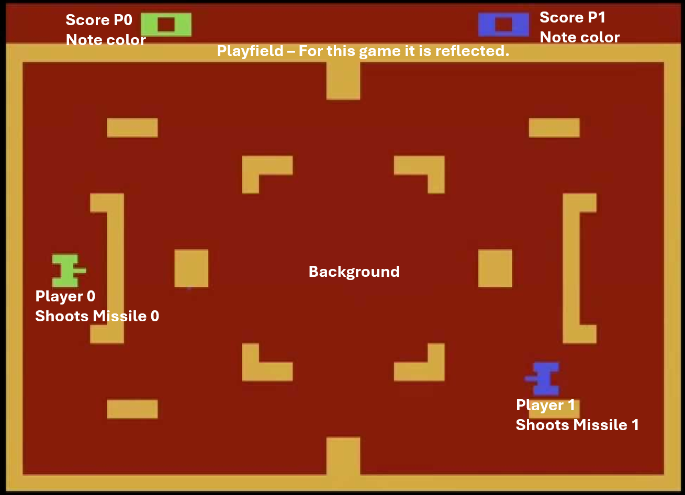
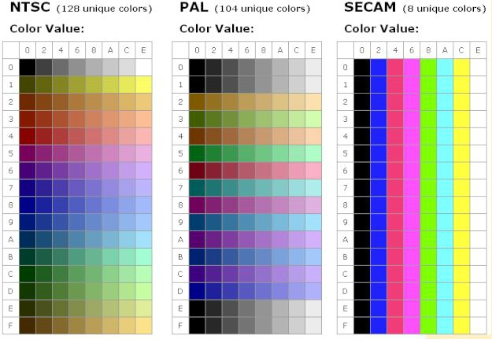

---------------- Table of Contents ---------------- 

1. [Admin](#admin)
2. [Assignments](#assignment)
3. [Getting Started](#getstart)
4. [Backgrounds](#background)
	* [Background Code Example](#backcode)
5. [Playfield Example](#classpf)
6. [Playfields](#playfields)
	* [Playfield Code Example](#playfield)
7. [Combined](#combo)
8. [One Last Example](#masswerk)

---------------- Table of Contents ---------------- 
# <a id='admin'></a>Admin
I have gone through most of the reading assignments and made comments. I will reiterate that it is important for you to get these in sooner rather than later as it can help me know how you're doing, what you don't get, what you need to learn. If you don't make suggestions or responses, then I'll just keep focusing on what i need to learn. 
# <a id='assignment'></a>Assignment
This week, we're doing Source Code reading. This will probably be a bit difficult at first but I just want you to try your best. As we move forward, it will get easier as you'll be exposed to more stuff. The point of assignments like these is to get you used to looking through source files for inspiration and fixes for things. 

The first assignment is simple, I want the labels that check for missile collision with walls and the playfield and I want you to tell me how they work and what the logic is. I want you to speculate a little as this is the first time so you probably won't exactly know but this source is VERY well commented and is the prototype of everything for the console.
# <a id = "getstart"></a>Getting Started with Graphics
The Atari 2600 has a chip that processes game logic and a Television Interface Adapter that sends that logic to the television screen. It literally paints the screen in real time as the processor goes through the logic. This is why we tie everything to our frame as we count the various scanlines. 

I have tried to say this as often as I can and i'm hoping you're sick of hearing about it because it means you've heard me. So now, we're going to move forward and actually do something with it.

You're looking through [[Combat]] this week and reading some source code. I'm doing this to sort of force the idea of thinking about code, reading code, poaching code, and just sort of getting familiar with it all. There are a variety of things we need to keep track of here. First, let's think about this: 

	The background dictates the color of certain things. For example. Consider how colors in the 2600 work. We know that it can display a total of 128 colors and they can be displayed at the same time but below each other or in each individual scanline. 

This allows for our rainbow to appear though we were not going with all 128! Next, each scanline can only have 4 colors displayed at any given time.

Finally, it is important to remember that some stuff shares colors. So, these share colors:
* Playfield and Ball 
* Player0 and missile0 
* Player1 and missile1 
	* Of these, score will also share player0/1 color as well.

And to that end, we have 7 distinct game elements. Those elements are: 
1. Background 
2. Playfield 
3. Player 1 
4. Player 2 
5. Missile 1 
6. Missile 2 
7. Ball

There can also be score but this is also part of the playfield. 

So let's think about this image again: 


We messed with this a little because of last week where we literally set up our frame and started making 3 scanlines and made a gentle rainbow. This is all background and so we will be moving from background to playfield in this lesson. As a refresher: 



For reference, here's a Hex value color chart: 

Additionally, we're going 

We're going to mess around with a number of OpCodes today. Namely, we'll be mucking about with: 
* `COLUBK` or Color of the Background.
* `COLUPF` or Color of the Playfield.
* `CTRLPF` or Control Playfield, Ball
	* This is basically a flag but we set it by value. 
	* D0: Reflect the playfield.
	* D1: Score
	* D2: Priority
	* D4-D5: Ball Size (1,2,4,8)
* `PF0,PF1,PF2` - Playfield Registers all are essentially binaries. 1 mean active, 0 means inactive.
	* `PF0` = bytes 4,5,6,7
	* `PF1` = bytes 7,6,5,4,3,2,1,0
	* `PF2`= bytes 0,1,2,3,4,5,6,7

We won't get into a lot of these last ones with the ball today but it's good to introduce it here. A good list of what these are can be found: https://8bitworkshop.com/docs/platforms/vcs/
# <a id="background"></a>Background
The background dictates the color of certain things. For example. Consider how colors in the 2600 work. We know that it can display a total of 128 colors and they can be displayed at the same time but below each other or in each individual scanline. 

This allows for our rainbow to appear though we were not going with all 128! Next, each scanline can only have 4 colors displayed at any given time. 

Finally, it is important to remember that some stuff shares colors. So: 
* Playfield and Ball 
* Player0 and missile0 
* Player1 and missile1 

This leaves us with 7 distinct game elements. Those elements are: 
1. Background 
2. Playfield 
3. Player 1 
4. Player 2 
5. Missile 1 
6. Missile 2 
7. Ball

While this doesn't seem like a lot, we got to keep all of this in mind while we work on our games. For example, while the playfield and ball have the same color, we need to be mindful of player0 and player1's color difference, especially as it relates to both the background and playfield. Should these things match, you may have some issues! 

First, let's mess a bit with some background colors. Let's go ahead and set up our basic shell.

```asm6502
	processor 6502
	include "vcs.h"
    include "macro.h"
    include "xmacro.h"
        
	seg	main
	org 	$F000
    
START: CLEAN_START

	org $FFFC
	.word START
	.word START
```

# Background Example
We can also try and do some stuff from Oscar Toledo: https://github.com/nanochess/book-Atari

We won't do this example in class but here's just a straight up background example.
```asm6502
;==========================
; Like always, let's get ourselves into 6502.
;==========================
	
	PROCESSOR 6502
	INCLUDE "vcs.h"
	INCLUDE "macro.h"

	ORG $F000

;==========================
; We start ourselves in memory slot F000 and use macro.h
;==========================

START: CLEAN_START

;==========================
; Like always, let's get ourselves into 6502.
;==========================

SHOW_FRAME:
	LDA #$88
	STA COLUBK

	STA WSYNC
	LDA #2
	STA VSYNC
	STA WSYNC
	STA WSYNC
	STA WSYNC
	LDA #0
	STA VSYNC

	LDX #36

TOP:
	STA WSYNC
	DEX
	BNE TOP
	LDA #0
	STA VBLANK

	LDX #192
	
VISIBLE:
	STA WSYNC
	DEX
	BNE VISIBLE

	LDA #2
	STA VBLANK
	LDX #30

BOTTOM:
	STA WSYNC
	DEX
	BNE BOTTOM

	JMP SHOW_FRAME

	ORG $FFFC
	.word START
	.word START
```

and we can augment this a bit. 

```ASM6502
;==========================
; Like always, let's get ourselves into 6502.
;==========================
	
	PROCESSOR 6502
	INCLUDE "vcs.h"
	INCLUDE "macro.h"

	SEG Code
	ORG $F000

;==========================
; We start ourselves in memory slot F000 and use macro.h
;==========================

START: CLEAN_START

;==========================
; Let's get started with our frame.
;==========================

SHOW_FRAME:
	LDA #$88	; this is a blueish color
	STA COLUBK	; and we set it to background

	STA WSYNC	; Wait a line.
	LDA #2
	STA VSYNC	; Turn on VSYNC
	STA WSYNC	; Wait.
	STA WSYNC	; Wait.
	STA WSYNC	; Wait.
	LDA #0		; Load 0 into A
	STA VSYNC	; Turn off VSYNC

;==========================
; Waiting for VBLANK so we can get to drawable space.
;==========================

	LDX #36		; Now we get ready for VBLANK!
	
TOP:
	STA WSYNC	; Here, we're basically waiting for 36
	DEX
	BNE TOP
	LDA #0
	STA VBLANK	; And turning off VBLANK

;==========================
; Now we setting up halvsies. 192/2 = 96
; Do you think we could do 192/3? Try it!!!
;==========================

	LDX #96		; Now we get ready for 96 lines!
	
VISIBLE:
	STA WSYNC	; And wait.
	DEX		; What we're doing is waiting 96 lines.
	BNE VISIBLE

	LDA #$F9	; Now it's time to load something else
	STA COLUBK	; Into the background. 

;==========================
; So we set with the top half and loaded A with the new value. We can do this because the math works out.
; The line starts drawing AS the value changes.
;==========================

	LDX #96		; More of the same but with a new color.
	
VISIBLE2:	
	STA WSYNC	; And we wait 96 lines.
	DEX		; That's 92!
	BNE VISIBLE2	; Try setting it to thirds?

	LDA #2		; Now we turn on VBLANK
	STA VBLANK	
	LDX #30

;==========================
; And we end up rounding it out. 
;==========================

BOTTOM:
	STA WSYNC	; And get our VBLANK to get to top.
	DEX
	BNE BOTTOM	

	JMP SHOW_FRAME	; And restart.

	ORG $FFFC	; Don't forget this! 
	.word START	
	.word START

```

# <a id ='classpf'></a>Playfield example 
This is the code I wanted to demo in class as it introduces a TON of concepts. 

```asm6502

;==========================
; Assembler should use basic 6502
;==========================

	processor 6502
	
;==========================
; Include files for Atari 2600 constants and handy macro routines
;==========================
	
	include "vcs.h"
	include "macro.h"

;==========================
; 4K Atari 2600 ROMs usually start at address $F000
;==========================

	org  $f000

;==========================
; The CLEAN_START macro zeroes RAM and registers
;==========================

Start	CLEAN_START 	; check out macro.h for this. 

;==========================
; What we got here is not variables or dependencies.
; Instead, we're setting up the colors and things
; Background and Playfield colors here
;==========================

	ldx #$80	; This is the hex code for a dark blue.
    stx COLUBK	; This will set the background blue.
    lda #$1C	; This is the hex for bright yellow.
    sta COLUPF	; This will store the hex value as the color of the playfield.

;==========================
; As usual, we need to take care of our start frames and blanks.
;==========================

StartFrame:
	lda #02		; we need to send a bit that turns on something.
    sta VBLANK	; In this case, we're turning on VBLANK and VSYNC
    sta VSYNC	; MAIN SCREEN, TURN ON

;==========================
;We gonna do something funky here with DASM codes instead of OPCODES.
;==========================

	REPEAT 3	; Repeat 3 times
	sta WSYNC	; 3 Scanlines of WSYNC
    REPEND		; Repeat Ends 
        
;==========================
; We then need to turn those things off so we can move into the next part above the drawable area.
;==========================

    lda #0		; Load byte of 0
    sta VSYNC	; Store that byte as VSYNC, thus turning it off. 

;==========================
;	Now we have to get ourselves down 37 lines to get to the drawable area. 
;==========================

	REPEAT 37	; Repeat this 37 times.
    sta WSYNC	; Wait for the next scanline.
    REPEND		; Repeat ends after 37 times.
        
    lda #0		; Load byte of 0
    sta VBLANK	; Store that byte as VSYNC, thus turning it off. 

;==========================
; We turn off VSYNC and VBLANK to do this and get ourselves set up to DO STUFF and DRAW. 
;Let's set up the playfield and deal with CTLPF
;==========================

	ldx #%00000001	; CTRLPF of D0 means reflect. Try setting this to 0 and see what happens. 
	stx CTRLPF 	; Load this bit 
        
;==========================
;	Now it's time to do stuff with our 192 lines. We have to deal with it mathematically. 
;==========================

;==========================
; 192 total lines, 10 lines down, playfield begins, playfield is 8 lines tall. 
;So, let's math it out. 10 + 8 + 8 + 10 = 156
;==========================

	ldx #0		; We load a value that is blank
    stx PF0		; this disables the PF0 Playfield Register.
    stx PF1		; this disables the PF1 Playfield Register.
    stx PF2		; this disables the PF2 Playfield Register.
        
    REPEAT 10
	sta WSYNC   ; We're waiting for the next scanline
    REPEND
;==========================
; Now we'll load the top line.
;==========================

    ldx #%11100000	; PF0 is just 4 bits and they're the high bits so 1110 for not computers is 0111 or "Skip a line then do it." However, DASM expects us to account for all 8 bytes.
    
    stx PF0
    ldx #%11111111	; This is the whole border line here and not just the corner.
    stx PF1		; We then load this binary data into the register for playfield 1	
    stx PF2		; We then load this binary data into the register for playfield 2
        
    REPEAT 8	; we need to make it 8 lines high.
    sta WSYNC	; So basically wait for 8 lines running that.
    REPEND		; and then end.

;==========================		
; Then deal with the middle.
;==========================

    ldx #%00100000	; We need to skip 2 clock cycles and then draw a pixel then skip another clock cycle. Remember, DASM expects us to account for all 8 bytes.
    
	stx PF0		; we can store this data into the PF0 register which will basically allow us to create our corners.
    ldx #0		; Then we load a 0 into X
    stx PF1		; store that 0 into PF1
    stx PF2		; store that 0 into PF2
        
    REPEAT 156	; If you go outside of the drawable area, all hell breaks loose.
    sta WSYNC	; Wait 156 lines.
    REPEND	

;==========================
; Now, we have to deal with the bottom.
;==========================
        
    ldx #%11100000	; PF0 is just 4 bits and they're the high bits so 1110 for not computers is 0111 or "Skip a line then do it." However, DASM expects us to account for all 8 bytes.
    stx PF0
    ldx #%11111111	; This is the whole border line here and not just the corner.
    stx PF1		; We then load this binary data into the register for playfield 1	
    stx PF2		; We then load this binary data into the register for playfield 2

	REPEAT 8	; we need to make it 8 lines high.
    sta WSYNC	; So basically wait for 8 lines running that.
    REPEND		; and then end.

;==========================
; and then the end of the playfield screen. 
;==========================

    ldx #0		; We load a value that is blank
    stx PF0		; this basically disables the PF0 Playfield Register.
    stx PF1		; this basically disables the PF1 Playfield Register.
    stx PF2		; this basically disables the PF2 Playfield Register.
        
    REPEAT 10
    sta WSYNC
    REPEND

;==========================
; And so now our logic and drawing is done. We have an overscan space of 30 lines. So, let's do that.
;==========================

	lda #2		; A value of 2 turns on VBLANK
	sta VBLANK	; Turn on VBLANK
        
    REPEAT 30	; Repeat this 30 times.
    sta WSYNC	; Wait for the next scanline.
    REPEND		; Repeat ends after 30 times.

;==========================
; Let's jump to the next frame. 
;==========================

	jmp StartFrame	; What happens if, after processing a frame, we skip to the START instead of the frame/kernel?

;==========================
; And we making sure our file is exactly 4k.
;==========================
	org $fffc
	.word Start
	.word Start
```
# <a id='playfield'></a>Playfield Example 2

We're going to take a piece of a tutorial from a youtuber named 8blit and work on it a bit. You can find this on his github repository at: https://github.com/kreiach/8Blit

```asm6502
	processor 6502		; We need to call into being the 6502 on our IDE.
	include	 "vcs.h"
    include "macro.h"

; For this task, we're going to actually use some memory to mess around with the TIA PF0, PF1, PF2, and CTLRPF Registers. Along the way, we'll explore the issues of overscanning and safe areas to draw in the safe visual area of the screen with the the recommended number of VBLANK's

PFCOLOR equ #$F9 

; ----- Start of main segment -----

	seg	main
	org 	$F000

; ----- Start of program execution -----

start CLEAN_START
  
clear:	sta 	0,X 	; $0 to $7F (0-127) reserved OS page zero, $80 to $FF (128-255) user zero page ram.
	inx 
	bne 	clear

	lda 	#%00000001	; Set D0 to reflect the playfield
	sta 	CTRLPF	; Apply to the CTRLPF register

	lda 	#PFCOLOR			
	sta 	COLUPF	; Set the PF color

; ----- Begin main loop -----

startframe: 			
						
; ------- 76543210 ---------- Bit order
	lda 	#%00000010	; Writing a bit into the D1 vsync latch
	sta 	VSYNC 

; ----- 3 scanlines of VSYNC signal
	sta 	WSYNC
	sta 	WSYNC
	sta 	WSYNC  

; ----- Turn off VSYNC         	 
	lda 	#0
	sta	 	VSYNC

; ----- Additional 37 scanlines of vertical blank -----
	ldx 	#0 					
lvblank:
	sta 	WSYNC
	inx
	cpx 	#37	; 37 scanlines of vertical blank
	bne 	lvblank
				
; ----- 192 lines of drawfield -----

	ldx 	#0 					
drawfield: 
	lda 	#%11111111 ; Solid row of pixels for all PF# registers
	sta PF0
	sta	PF1
	sta	PF2				

	sta 	WSYNC
	inx  
	cpx 	#192
	bne 	drawfield

; ----- 30 scanlines of overscan -----
	lda     #%00000000
	sta     PF0
	sta     PF1
	sta     PF2

	ldx 	#0					
overscan:
	sta 	WSYNC
	inx
	cpx 	#30
	bne 	overscan

; ----- End of overscan -----
	jmp 	startframe	; jump back up to start the next frame

; ----- Pad until end of main segment -----

	org 	$FFFA
	
	.word 	start         	; NMI
	.word 	start         	; RESET
	.word 	start         	; IRQ

; ----- End of main segment -----
```
# <a id ='masswerk'></a>