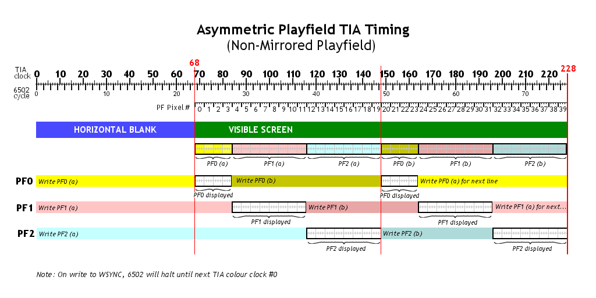
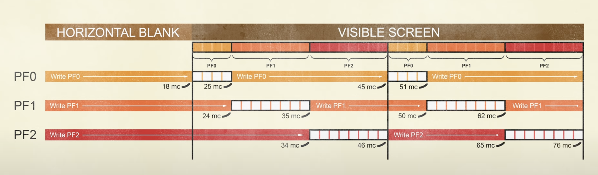

---------------- Table of Contents ---------------- 

1. [Admin](#admin)
2. [Getting Started](#getstart)
3. [Hello World](#helloworld)
4. [Hell World](#hellworld)

---------------- Table of Contents ---------------- 
This week we're mostly going to play a selection of games that are asymmetric. We'll see if we can find the source code as COMBAT is not. 
# <a id = "Admin"></a>Admin
We're doing source code reading this week. One thing I want you to pay attention to is the structure of games. You'll have to decide what works for you. 
# Clock Cycles
If you notice on the resolution picture I keep showing, the x-axis isn't coordinates, but clock cycles. 68 cycles gets us over to the actual tv picture and then we have 160 clock counts that are viewable. 

The 6507 CPU in the Atari 2600 performs its instructions to the rhythm of a system clock. Each tick of this system clock is referred to as a clock-cycle. 6507 instructions are often measured by how many clock cycles they take, since it's more convenient to say (for example) that an instruction takes 2 clock cycles, instead of saying the instruction takes 0.000001681 seconds.

This gets into a particular issue, math. Note that there are around 76 cycles per scanline. So, you have 76 clock cycles as the CRT draws the line. From there, we have 262 scanlines per NTSC frame. From this, we can say that there are around 19912 cycles per frame. We get this by multiplying 76`*`262. IF we then consider that a NTSC have a frame rate of around 59.94Hz, we can then multiply that with 19912. This will result in 1193525.28. This number is the speed of the processor we're working on as our processing chip has a speed of 1.19MHz.

So, we have to fit things into an ever tightening frame inside an ever tightening frame rate, inside of an ever tightening computation space.

This is something we have to view on our own so we're going to work on a piece of code that demonstrates different ways to deal with the clock cycles. 

# <a id='getstart'></a>Asymmetry and Timing
So, we're taking the stuff we had from the original playfield exercise and now we're doing stuff asymmetrically. This increases our difficulty and processing space in ways that are complicated. Instead of just mirroring or repeating, we have to think across the whole screen. Note that in the above image, there's 228 clock cycles. We have to account for this as we only have 3 registers to write the screen to but we need to write 6 times. This means that we have to write and rewrite the screen. Just keep this image in mind: 



Or another version of this from 8blit: 

Let's get on with the example: 
# Example - Nick Bensema
This is an example that has been around for almost 30 years now. We're going to go through it and adjust some of this stuff. The goal of this code is to provide a way through which to build our games. It also introduces timers, a different model for organizing your game, and maths, so much maths.

```asm6502
; How to Draw A Playfield.
; by Nick Bensema  9:23PM  3/2/97

; Atari 2600 programming is different from any other kind of programming in many ways.  Just one of these ways is the flow of the program.

; Since the CPU must hold tha TIA's hand through all graphical operations, the flow ought to go like this:

; Clear memory and registers
; Set up variables
; Loop:
;    Do the vertical blank
;    Do game calculations
;    Draw screen
;    Do more calculations during overscan
;    Wait for next vertical blank
; End Loop.

; What I will do is create an outline, and explain everything I can. This program will display "HELLO" and scroll it down the screen.

; In writing this program, I will take the opportunity to show you how a few simple modifications can completely change a program's appearance or behavior.  I will invite you to comment out a few lines of code, and alter others, so that you can observe the results.

; I will be using DASM for now. Conversion to A65 should be trivial.

        processor 6502
        include vcs.h
        
        org $F000

Temp       = $80
PlayfieldY = $90

Start

; The 2600 powers up in a completely random state, except for the PC which is set to the location at $FFC.  Therefore the first thing we must do is to set everything up inside the 6502.

        SEI  ; Disable interrupts, if there are any.
        CLD  ; Clear BCD math bit.

; You may feel the need to use the stack, in which case:

        LDX  #$FF
        TXS  ; Set stack to beginning.

; Now the memory and TIA registers must be cleared.  You may feel the need to write a subroutine that only clears out a certain section of memory, but for now a simple loop will suffice.

; Since X is already loaded to 0xFF, our task becomes simply to count everything off.

        LDA #0
B1      STA 0,X
        DEX
        BNE B1

; The above routine does not clear location 0, which is VSYNC.  We will take care of that later.

; At this point in the code we would set up things like the data direction registers for the joysticks and such.

        JSR  GameInit

; Here is a representation of our program flow.

MainLoop
        JSR  VerticalBlank ;Vertical blank.
        JSR  CheckSwitches ;Console switches.
        JSR  GameCalc      ;Calculations during Vblank
        JSR  DrawScreen    ;Draw the screen
        JSR  OverScan      ;More calculations during overscan
        JMP  MainLoop      ;Continue forever.

; It is important to maintain a stable screen, and this routine does some important and mysterious things.  Actually, the only mysterious part is VSYNC.  All VBLANK does is blank the TIA's output so that no graphics are drawn; otherwise the screen scans normally.  It is VSYNC which tells the TV to pack its bags and move to the other corner of the screen.

; Fortunately, my program sets VBLANK at the beginning of the overscan period, which usually precedes this subroutine, so it is not changed here.

VerticalBlank
        LDX  #0
        LDA  #2
        STA  WSYNC
        STA  WSYNC
        STA  WSYNC

        STA  VSYNC ;Begin vertical sync.
        STA  WSYNC ; First line of VSYNC
        STA  WSYNC ; Second line of VSYNC.

; But before we finish off the third line of VSYNC, why don't we use this time to set the timer?  This will save us a few cycles which would be more useful in the overscan area.

; To insure that we begin to draw the screen at the proper time, we must set the timer to go off just slightly before the end of the vertical blank space, so that we can WSYNC up to the ACTUAL end of the vertical blank space.  Of course, the scanline we're going to omit is the same scanline we were about to waste VSYNCing, so it all evens out.

; Atari says we have to have 37 scanlines of VBLANK time.  Since each scanline uses 76 cycles, that makes 37*76=2888 cycles. We must also subtract the five cycles it will take to set the timer, and the three cycles it will take to STA WSYNC to the next line.  Plus the checking loop is only accurate to six cycles, making a total of fourteen cycles we have to waste.  2888-14=2876.

; We almost always use TIM64T for this, since the math just won't work out with the other intervals. 2880/64=44.something.  It doesn't matter what that something is, we have to round DOWN.

        LDA  #44
        STA  TIM64T

; And now's as good a time as any to clear the collision latches.

        LDA #0
        STA CXCLR

; Now we can end the VSYNC period.

        STA  WSYNC ; Third line of VSYNC.
        STA  VSYNC ; (0)

; At this point in time the screen is scanning normally, but the TIA's output is suppressed.  It will begin again once 0 is written back into VBLANK.

        RTS
        
; Checking the game switches is relatively simple.  Theoretically, some of it could be slipped between WSYNCs in the VBlank code.

;But we're going for clarity here. It just so happens that I'm not going to check any game switches here.  I'm just going to set up the colors, without even checking the B&W switch!  HA!

CheckSwitches
       LDA #0
       STA COLUBK  ; Background will be black.
       RTS

; Minimal game calculations, just to get the ball rolling.

GameCalc
        INC PlayfieldY   ;Inch up the playfield
        RTS


; This is the scariest thing I've done all month.

DrawScreen
        LDA INTIM
        BNE DrawScreen ; Whew!
        STA WSYNC
        STA VBLANK  ;End the VBLANK period with a zero.
        
; Now we can do what we need to do.  What sort of playfield do we want to show?  A doubled playfield will work better than anything if we either want a side scroller (which involves some tricky bit shifting, usually) or an asymmetrical playfield (which we're not doing yet).  A mirrored playfield is usually best for vertical scrollers.  With some creativity, you can use both in your game.

; The "score" bit is useful for drawing scores with playfield graphics as Combat and other early games do.  It can also create a neat effect if you know how to be creative with it.  One useful application of score mode would be always having player 1 on the left side, and player 0 on the right side.  Each player would be surrounded in the opposite color, and the ball graphic could be used to stand out against either one.  On my 2600jr, color from the right side bleeds about one pixel into the left side, so don't think it's perfect.

;It's really far from perfect because PC Atari does not implement it at all; both sides appear as Player 0's color.  A26 does, though.

;To accomodate this, my routine puts color values into COLUP0 for the left side, and COLUP1 for the right side.  Change the LDA operand to 0 or 1 to use the normal system.  The code in the scanning loop accounts for both systems.

        LDA  #2
        STA  CTRLPF

; Initialize some display variables.

        ;There aren't any display variables!

; I'm going to use the Y register to count scanlines this time. Realize that I am forfeiting the use of the Y register for this purpose, but DEC Zero Page takes five cycles as opposed to DEY's two, and LDA Zero Page takes three cycles as opposed to TYA's two.

; I'm using all 191 remaining scanlines after the WSYNC.  If you want less, or more, change the LDY line.

; This is a decremental loop, that is, Y starts at 191 and continues down to 0, as do all functions of Y such as memory locations, which is why the graphics at the end of this file are stored "bottom-up".

;In a way, one could say that's how the screen is drawn. To turn this into an incremental loop, change the number to 255-191 (65) and change the DEY at the end ot the scanning loop to INY.

        LDY #191

; Okay, now THIS is scary.  I decided to put the bulk of my comments BEFORE the code, rather than inside it, so that you can look at the code all at once.

; Notice the new method of cycle counting I use.  I'll send an update to cyccount.txt RSN.

; This routine came out surprisingly clean.  There are no branches, and most updates are made even before PF0 becomes visible at cycle 23, even though PF1 and PF2 don't become visible until, by my estimate, cycles 29 and 40, respectively.  We could use this time to get player shape and colors from temp variables and sneak them in, but that's another file.  

;In fact, at the last minute I re-arranged things and threw in some color changes.

; The playfield will only be moved up every 4 scanlines, so it doesn't look squished.  I could have updated it every 2 scanlines, and that would have saved two cycles. I could have saved another two cycles by having it change EVERY scanline. 

;Comment out one or both of the ASL's to see what this would look like.  I realize that it updates the PF registers whether it needs it or not, but it would be pointless to branch around these updates.  Better to know you're wasting cycles and have them counted than to get unlucky and have your code spill into the next scanline every time too many things get updated.

; This is going to be a moving playfield.  For a stationary playfield, comment out the SEC and SBC lines.  That's probably what most of you all are going to want, anyway.  And for a really good moving playfield, like in River Raid or Vanguard, you'll need slightly more interesting code than I'm prepared to provide.

; I also could have made the playfield graphic 16 bytes high, or 32, or 64, by changing only my data and the AND line. AND can serve as a modulus for any power of two (2^n) up to 128, by ANDing a byte with that number minus one ( (2^n)-1 ).  8 bytes * every 4 scanlines == 32, which is a power of two, which is why this works.  Try commenting out the AND line and see how the program interprets it. Remember that PlayfieldY goes up to 255.

; But you won't need to worry about that if you're drawing a stationary playfield where the graphics data is so large, it doesn't need to repeat. In that case, you don't need the AND line and you don't need to make sure your graphics are 2^n bytes tall.  

; Comment out the AND, SEC and SBC lines, and add a third LSR to the block of two.  It indexes a bit too far at the top of the screen, which explains the garbage.  You can fix that problem either by adding more data to the end of each array, or by decreasing the resolution by adding a fourth or fifth LSR.

; And who's to say you'll need all three playfield registers?  Perhaps you have a rather narrow playfield, or one that's always clear in the middle.  Either choice will save you five cycles per scanline.

; As you can see, it can be trimmed down quite a bit, and I still have a lot of cycles left over.  The maximum, if you recall, is 73 if you plan to use STA WSYNC, and I pity the fool who doesn't.

ScanLoop
; Result of the following math is:
;  X = ( (Y-PlayfieldY) /4 ) mod 7
        TYA		; Transfer Y to the accumulator.
        SEC		; turn on the carry flag.
        SBC PlayfieldY	; subtract with carry.
        LSR   		; shift right - Divide by 2
        LSR		    ; shift right - Divide by 2
        AND #7  	; Binary bitwise comparison 
        TAX		    ; Transfers A to X
        LDA PFData0,X   ;Load ahead of time.

; So what is the K.I.S.S. of this part? We are basically loading 191 into Y. We then transfer Y into A, turn on the carry flag (basically make it so math can happen), subtract the current value of PlayfieldY (it starts around 30), divide by 2, divide by 2, then take the binary of that number and compare it to the binary of 7. This number is then transferred to X and so then X will continue to read through the byte table starting with 7 on down as Y decreases. Note that we decrement Y before the loop begins again.

; WSYNC is placed BEFORE all of this action takes place.

        STA WSYNC
        STA PF0                 ;[0] +3 = *3*   < 23
        LDA PFLColor,X          ;[3] +4
        ;In a real game, I wouldn't be this redundant.
        STA COLUP0              ;[7] +3 = *10*  < 23
        STA COLUPF              ;[10]+3 = *13*  < 23
        LDA PFData1,X           ;[13]+4
        STA PF1                 ;[17]+3 = *20*  < 29
        LDA PFRColor,X          ;[20]+4
        STA COLUP1              ;[24]+3 = *27*  < 49
        LDA PFData2,X           ;[27]+4
        STA PF2                 ;[31]+3 = *34*  < 40
        DEY
        BNE ScanLoop

; Clear all registers here to prevent any possible bleeding.

        LDA #2
        STA WSYNC  ;Finish this scanline.
        STA VBLANK ; Make TIA output invisible,
        ; Now we need to worry about it bleeding when we turn
        ; the TIA output back on.
        ; Y is still zero.
        STY PF0
        STY PF1
        STY PF1
        STY GRP0
        STY GRP1
        STY ENAM0
        STY ENAM1
        STY ENABL
        RTS

; For the Overscan routine, one might take the time to process such things as collisions.  I, however, would rather waste a bunch of scanlines, since I haven't drawn any players yet.

OverScan   ;We've got 30 scanlines to kill.
        LDX #30
KillLines
         STA WSYNC
         DEX
         BNE KillLines
        RTS

; GameInit could conceivably be called when the Select key is pressed, or some other event.

GameInit
        LDA #0
        STA PlayfieldY
        RTS


; Graphics are placed so that the extra cycle in the PFData,X indexes is NEVER taken, by making sure it never has to index across a page
; boundary.  This way our cycle count holds true.

        org $FF00

; This is the tricky part of drawing a playfield: actually drawing it.  Well, the display routine and all that binary math was a bit tricky, too, but still, listen up.

; Playfield data isn't stored the way most bitmaps are, even one-dimensional bitmaps.  We will use the left side of the screen only, knowing that the right side is either repeated or reflected from it.

; In PF0 and PF2, the most significant bit (bit 7) is on the RIGHT side.  In PF1, the most significant bit is on the LEFT side. 

;This means that relative to PF0 and PF2, PF1 has a reversed bit order. It's just really weird.

;    PF0  |     PF1       |      PF2
;  4 5 6 7|7 6 5 4 3 2 1 0|0 1 2 3 4 5 6 7

; This is important to remember when doing calculations on bytes intended for the PF registers. Defender gives a good example of this.

; It will become necessary to write a program that makes this easier, because it is easy to become confused when dealing with this system.

PFData0  ;H       4 5 6 7
       .byte $00,$f0,$00,$A0,$A0,$E0,$A0,$A0
PFData1  ;EL      7 6 5 4 3 2 1 0
       .byte $00,$FF,$00,$77,$44,$64,$44,$74
PFData2  ;LO      0 1 2 3 4 5 6 7
       .byte $00,$FF,$00,$EE,$A2,$A2,$A2,$E2
PFLColor ; Left side of screen
       .byte $00,$FF,$00,$22,$26,$2A,$2C,$2E
PFRColor ; Right side of screen
       .byte $00,$1F,$00,$6E,$6C,$6A,$66,$62

        org $FFFC
        .word Start
        .word Start
```

So this was how it was originally written. Let's take out some stuff and get ourselves into what we've been already learning. 

```asm6502
        processor 6502
        include "vcs.h"
        include "macro.h"

		SEG Variables
		org $80

Temp       = $80
PlayfieldY = $90

		SEG Code
        org $F000

Start CLEAN_START

        JSR  GameInit

MainLoop
        JSR  VerticalBlank ;Execute the vertical blank.
        JSR  CheckSwitches ;Check console switches.
        JSR  GameCalc      ;Do calculations during Vblank
        JSR  DrawScreen    ;Draw the screen
        JSR  OverScan      ;Do more calculations during overscan
        JMP  MainLoop      ;Continue forever.

VerticalBlank
        LDX  #0
        LDA  #2
        STA  WSYNC
        STA  WSYNC
        STA  WSYNC
        
        STA  VSYNC ;Begin vertical sync.
        STA  WSYNC ; First line of VSYNC
        STA  WSYNC ; Second line of VSYNC.

        LDA  #44
        STA  TIM64T

        LDA #0
        STA CXCLR

        STA  WSYNC ; Third line of VSYNC.
        STA  VSYNC ; (0)
        RTS

CheckSwitches
       LDA #0
       STA COLUBK  ; Background will be black.
       RTS

GameCalc
        INC PlayfieldY   ;Inch up the playfield
        RTS

DrawScreen
        LDA INTIM
        BNE DrawScreen ; Whew!
        STA WSYNC
        STA VBLANK  ;End the VBLANK period with a zero.

        LDA  #2
        STA  CTRLPF

		LDY #191

ScanLoop
; Result of the following math is:
;  X = ( (Y-PlayfieldY) /4 ) mod 7
        TYA
        SEC
        SBC PlayfieldY
        LSR   ;Divide by 4
        LSR
        AND #7  ;modulo 8
        TAX
        LDA PFData0,X           ;Load ahead of time.
        
; WSYNC is placed BEFORE all of this action takes place.

        STA WSYNC
        STA PF0                 ;[0] +3 = *3*   < 23
        LDA PFLColor,X          ;[3] +4
        
        ;In a real game, I wouldn't be this redundant.
        
        STA COLUP0              ;[7] +3 = *10*  < 23
        STA COLUPF              ;[10]+3 = *13*  < 23
        LDA PFData1,X           ;[13]+4
        STA PF1                 ;[17]+3 = *20*  < 29
        LDA PFRColor,X          ;[20]+4
        STA COLUP1              ;[24]+3 = *27*  < 49
        LDA PFData2,X           ;[27]+4
        STA PF2                 ;[31]+3 = *34*  < 40
        DEY
        BNE ScanLoop
;
; Clear all registers here to prevent any possible bleeding.
;
        LDA #2
        STA WSYNC  ;Finish this scanline.
        STA VBLANK ; Make TIA output invisible,
        ; Now we need to worry about it bleeding when we turn
        ; the TIA output back on.
        ; Y is still zero.
        STY PF0
        STY PF1
        STY PF1
        STY GRP0
        STY GRP1
        STY ENAM0
        STY ENAM1
        STY ENABL
        RTS

OverScan   ;We've got 30 scanlines to kill.
        LDX #30
KillLines
         STA WSYNC
         DEX
         BNE KillLines
        RTS

GameInit
        LDA #0
        STA PlayfieldY
        RTS

        org $FF00

PFData0  ;H       4 5 6 7
       .byte $00,$f0,$00,$A0,$A0,$E0,$A0,$A0
PFData1  ;EL      7 6 5 4 3 2 1 0
       .byte $00,$FF,$00,$77,$44,$64,$44,$74
PFData2  ;LO      0 1 2 3 4 5 6 7
       .byte $00,$FF,$00,$EE,$A2,$A2,$A2,$E2
PFLColor ; Left side of screen
       .byte $00,$FF,$00,$22,$26,$2A,$2C,$2E
PFRColor ; Right side of screen
       .byte $00,$1F,$00,$6E,$6C,$6A,$66,$62

        org $FFFC
        .word Start
        .word Start
```
# <a id='classexp'></a>Example
We'll be going through this in class. My hope here is to show you how the above examples work and in doing so, prepare you for your time if you want asymmetry in your life. Note here that it is not easy. I'll come up with some interesting examples for you at some point in the semester: 
```asm6502
;========================================
; A Simple Asymmetrical Title Screen Playfield
;
; this is a simple kernal meant to be usable for a title screen.
; can be adapted to put playfield text at an arbitrary height on the screen
;
; it owes a great debt to Glenn Saunders Thu, 20 Sep 2001 Stella post
; " Asymmetrical Reflected Playfield" (who in turn took from Roger Williams,
; who in turn took from Nick Bensema--yeesh!)
;
; it's meant to be a tightish, welll-commented, flexible kernal,
; that displays a title (or other playfield graphic) once, 
; instead of repeating it - also it's a steady 60 FPS, 262 scanlines,
; unlike some of its predecessors
;
; also, it's non-reflected, so you can easily use a tool like my
; online javascript tool at http://alienbill.com/vgames/playerpal/
; to draw the playfield
;
; It uses no RAM, but all Registers when it's drawing the title 
;========================================

	processor 6502
	include vcs.h
	include macro.h
	org $F000
	
Start
	CLEAN_START

	lda #00
	sta COLUBK  ;black background 	
	lda #33    
	sta COLUPF  ;colored playfield

;========================================
;MainLoop starts with usual VBLANK code,
;and the usual timer seeding
;========================================

MainLoop
	VERTICAL_SYNC
	lda #43	
	sta TIM64T
	
;========================================
; lots of logic can go here, obviously,
; and then we'll get to the point where we're waiting
; for the timer to run out
;========================================

WaitForVblankEnd
	lda INTIM	; So, we've written to the 64-timer. What this does is basically wait for the timer to end. We can really only use this when we're dealing with TIM64T
	bne WaitForVblankEnd	
	sta VBLANK  	

;========================================
;so, scanlines. We have three loops; 
;TitlePreLoop , TitleShowLoop, TitlePostLoop
;
; I found that if the 3 add up to 174 WSYNCS,
; you should get the desired 262 lines per frame
;
; The trick is, the middle loop is 
; how many pixels are in the playfield,
; times how many scanlines you want per "big" letter pixel 
;========================================

pixelHeightOfTitle = #6
scanlinesPerTitlePixel = #6

;========================================
; ok, that's a weird place to define constants, but whatever

;just burning scanlines....you could do something else
;========================================

	ldy #20
	
TitlePreLoop
	sta WSYNC	
	dey
	bne TitlePreLoop

	ldx #pixelHeightOfTitle ; X will hold what letter pixel we're on
	ldy #scanlinesPerTitlePixel ; Y will hold which scan line we're on for each pixel

;========================================
;the next part is careful cycle counting from those 
;who have gone before me....
;========================================

TitleShowLoop
	sta WSYNC 	
	lda PFData0Left-1,X           ;[0]+4
	sta PF0                 ;[4]+3 = *7*   < 23	;PF0 visible
	lda PFData1Left-1,X           ;[7]+4
	sta PF1                 ;[11]+3 = *14*  < 29	;PF1 visible
	lda PFData2Left-1,X           ;[14]+4
	sta PF2                 ;[18]+3 = *21*  < 40	;PF2 visible
	nop			;[21]+2
	nop			;[23]+2
	nop			;[25]+2
	;six cycles available  Might be able to do something here
	lda PFData0Right-1,X          ;[27]+4
	;PF0 no longer visible, safe to rewrite
	sta PF0                 ;[31]+3 = *34* 
	lda PFData1Right-1,X		;[34]+4
	;PF1 no longer visible, safe to rewrite
	sta PF1			;[38]+3 = *41*  
	lda PFData2Right-1,X		;[41]+4
	;PF2 rewrite must begin at exactly cycle 45!!, no more, no less
	sta PF2			;[45]+2 = *47*  ; >

;========================================

;========================================

	dey ;ok, we've drawn one more scaneline for this 'pixel'
	bne NotChangingWhatTitlePixel ;go to not changing if we still have more to do for this pixel
	dex ; we *are* changing what title pixel we're on...

	beq DoneWithTitle ; ...unless we're done, of course
	
	ldy #scanlinesPerTitlePixel ;...so load up Y with the count of how many scanlines for THIS pixel...

;========================================
;
;========================================

NotChangingWhatTitlePixel
	
	jmp TitleShowLoop

DoneWithTitle	

	;clear out the playfield registers for obvious reasons	
	lda #0
	sta PF2 ;clear out PF2 first, I found out through experience
	sta PF0
	sta PF1
;just burning scanlines....you could do something else
	ldy #137
TitlePostLoop
	sta WSYNC
	dey
	bne TitlePostLoop

; usual vblank
	lda #2		
	sta VBLANK 	
	ldx #30		
OverScanWait
	sta WSYNC
	dex
	bne OverScanWait
	jmp  MainLoop  

;========================================
; the graphics!
; I suggest my online javascript tool, 
;PlayfieldPal at http://alienbill.com/vgames/playerpal/
;to draw these things. Just rename 'em left and right
;========================================

PFData0Left
        .byte #%00000000
        .byte #%00000000
        .byte #%10000000
        .byte #%01000000
        .byte #%00000000
        .byte #%00000000

PFData1Left
        .byte #%00000000
        .byte #%00000000
        .byte #%00010011
        .byte #%10101010
        .byte #%10010010
        .byte #%10000000

PFData2Left
        .byte #%00000000
        .byte #%00000000
        .byte #%10001101
        .byte #%10001001
        .byte #%11011001
        .byte #%10000000


PFData0Right
        .byte #%00000000
        .byte #%00000000
        .byte #%01000000
        .byte #%11000000
        .byte #%01010000
        .byte #%11000000

PFData1Right
        .byte #%00000000
        .byte #%00000000
        .byte #%00010010
        .byte #%00101010
        .byte #%10010011
        .byte #%00000000

PFData2Right
        .byte #%00001100
        .byte #%00010000
        .byte #%00011001
        .byte #%00010101
        .byte #%00011000
        .byte #%00000000

	org $FFFC
	.word Start
	.word Start
```

# Another Example
This one comes from a legendary moment in the history of tutorials. Nick Bensema in 1997 wrote this: https://users.dcc.uchile.cl/~rbaeza/cursos/proyarq/avera/play.html. 

This example has a MASSIVE amount of new concepts, opcodes, and things.

```asm6502
; How to Draw A Playfield.
; by Nick Bensema  9:23PM  3/2/97
;
; Atari 2600 programming is different from any other kind of programming
; in many ways.  Just one of these ways is the flow of the program.
;
; Since the CPU must hold tha TIA's hand through all graphical operations,
; the flow ought to go like this:
;
; Clear memory and registers
; Set up variables

; Loop:
;    Do the vertical blank
;    Do game calculations
;    Draw screen
;    Do more calculations during overscan
;    Wait for next vertical blank

; End Loop.
;
; What I will do is create an outline, and explain everything I can.
; This program will display "HELLO" and scroll it down the screen.
;
; In writing this program, I will take the opportunity to show you
; how a few simple modifications can completely change a program's
; appearance or behavior.  I will invite you to comment out a few
; lines of code, and alter others, so that you can observe the results.
;
; I will be using DASM for now.  Conversion to A65 should be trivial.
;
        processor 6502
        include vcs.h

        org $F000

Temp       = $80
PlayfieldY = $90

Start
;
; The 2600 powers up in a completely random state, except for the PC which
; is set to the location at $FFC.  Therefore the first thing we must do is
; to set everything up inside the 6502.
;
        SEI  ; Disable interrupts, if there are any.
        CLD  ; Clear BCD math bit.
;
; You may feel the need to use the stack, in which case:
;
        LDX  #$FF
        TXS  ; Set stack to beginning.
;
; Now the memory and TIA registers must be cleared.  You may feel the
; need to write a subroutine that only clears out a certain section of
; memory, but for now a simple loop will suffice.
;
; Since X is already loaded to 0xFF, our task becomes simply to ocunt
; everything off.
;
        LDA #0
B1      STA 0,X
        DEX
        BNE B1
;
; The above routine does not clear location 0, which is VSYNC.  We will
; take care of that later.
;
; At this point in the code we would set up things like the data
; direction registers for the joysticks and such.
;
        JSR  GameInit
;
; Here is a representation of our program flow.
;
MainLoop
        JSR  VerticalBlank ;Execute the vertical blank.
        JSR  CheckSwitches ;Check console switches.
        JSR  GameCalc      ;Do calculations during Vblank
        JSR  DrawScreen    ;Draw the screen
        JSR  OverScan      ;Do more calculations during overscan
        JMP  MainLoop      ;Continue forever.
;
; It is important to maintain a stable screen, and this routine
; does some important and mysterious things.  Actually, the only
; mysterious part is VSYNC.  All VBLANK does is blank the TIA's
; output so that no graphics are drawn; otherwise the screen
; scans normally.  It is VSYNC which tells the TV to pack its
; bags and move to the other corner of the screen.
;
; Fortunately, my program sets VBLANK at the beginning of the
; overscan period, which usually precedes this subroutine, so
; it is not changed here.
;
VerticalBlank
        LDX  #0
        LDA  #2
        STA  WSYNC
        STA  WSYNC
        STA  WSYNC
        STA  VSYNC ;Begin vertical sync.
        STA  WSYNC ; First line of VSYNC
        STA  WSYNC ; Second line of VSYNC.
;
; But before we finish off the third line of VSYNC, why don't we
; use this time to set the timer?  This will save us a few cycles
; which would be more useful in the overscan area.
;
; To insure that we begin to draw the screen at the proper time,
; we must set the timer to go off just slightly before the end of
; the vertical blank space, so that we can WSYNC up to the ACTUAL
; end of the vertical blank space.  Of course, the scanline we're
; going to omit is the same scanline we were about to waste VSYNCing,
; so it all evens out.
;
; Atari says we have to have 37 scanlines of VBLANK time.  Since
; each scanline uses 76 cycles, that makes 37*76=2888 cycles.
; We must also subtract the five cycles it will take to set the
; timer, and the three cycles it will take to STA WSYNC to the next
; line.  Plus the checking loop is only accurate to six cycles, making
; a total of fourteen cycles we have to waste.  2888-14=2876.
;
; We almost always use TIM64T for this, since the math just won't
; work out with the other intervals.  2880/64=44.something.  It
; doesn't matter what that something is, we have to round DOWN.
;
        LDA  #44
        STA  TIM64T
;
; And now's as good a time as any to clear the collision latches.
;
        LDA #0
        STA CXCLR
;
; Now we can end the VSYNC period.
;
        STA  WSYNC ; Third line of VSYNC.
        STA  VSYNC ; (0)
;
; At this point in time the screen is scanning normally, but
; the TIA's output is suppressed.  It will begin again once
; 0 is written back into VBLANK.
;
        RTS
;
; Checking the game switches is relatively simple.  Theoretically,
; some of it could be slipped between WSYNCs in the VBlank code.
; But we're going for clarity here.
;
; It just so happens that I'm not going to check any game switches
; here.  I'm just going to set up the colors, without even checking
; the B&W switch!  HA!
;
CheckSwitches
       LDA #0
       STA COLUBK  ; Background will be black.
       RTS
;
; Minimal game calculations, just to get the ball rolling.
;
GameCalc
        INC PlayfieldY   ;Inch up the playfield
        RTS

;
; This is the scariest thing I've done all month.
;
DrawScreen
        LDA INTIM
        BNE DrawScreen ; Whew!
        STA WSYNC
        STA VBLANK  ;End the VBLANK period with a zero.
;
; Now we can do what we need to do.  What sort of playfield do
; we want to show?  A doubled playfield will work better than
; anything if we either want a side scroller (which involves some
; tricky bit shifting, usually) or an asymmetrical playfield (which
; we're not doing yet).  A mirrored playfield is usually best for
; vertical scrollers.  With some creativity, you can use both in your
; game.
;
; The "score" bit is useful for drawing scores with playfield graphics
; as Combat and other early games do.  It can also create a neat effect
; if you know how to be creative with it.  One useful application of
; score mode would be always having player 1 on the left side, and
; player 0 on the right side.  Each player would be surrounded in the
; opposite color, and the ball graphic could be used to stand out
; against either one.  On my 2600jr, color from the right side bleeds
; about one pixel into the left side, so don't think it's perfect.
; It's really far from perfect because PC Atari does not implement
; it at all; both sides appear as Player 0's color.  A26 does, though.
;
; To accomodate this, my routine puts color values into
; COLUP0 for the left side, and COLUP1 for the right side.  Change
; the LDA operand to 0 or 1 to use the normal system.  The code in
; the scanning loop accounts for both systems.
;
        LDA  #2
        STA  CTRLPF
;
; Initialize some display variables.
;
        ;There aren't any display variables!
;
; I'm going to use the Y register to count scanlines this time.
; Realize that I am forfeiting the use of the Y register for this
; purpose, but DEC Zero Page takes five cycles as opposed to DEY's
; two, and LDA Zero Page takes three cycles as opposed to TYA's two.
;
; I'm using all 191 remaining scanlines after the WSYNC.  If you
; want less, or more, change the LDY line.
;
; This is a decremental loop, that is, Y starts at 191 and continues
; down to 0, as do all functions of Y such as memory locations, which
; is why the graphics at the end of this file are stored "bottom-up".
; In a way, one could say that's how the screen is drawn.  To turn this
; into an incremental loop, change the number to 255-191 (65) and change
; the DEY at the end ot the scanning loop to INY.
;
        LDY #191
;
; Okay, now THIS is scary.  I decided to put the bulk of my comments
; BEFORE the code, rather than inside it, so that you can look at the
; code all at once.
;
; Notice the new method of cycle counting I use.  I'll send an update
; to cyccount.txt RSN.
;
; This routine came out surprisingly clean.  There are no branches,
; and most updates are made even before PF0 becomes visible at cycle 23,
; even though PF1 and PF2 don't become visible until, by my estimate,
; cycles 29 and 40, respectively.  We could use this time to get player
; shape and colors from temp variables and sneak them in, but that's
; another file.  In fact, at the last minute I re-arranged things
; and threw in some color changes.
;
; The playfield will only be moved up every 4 scanlines, so it doesn't look
; squished.  I could have updated it every 2 scanlines, and that would have
; saved two cycles. I could have saved another two cycles by having it
; change EVERY scanline.  Comment out one or both of the ASL's to see what
; this would look like.  I realize that it updates the PF registers whether
; it needs it or not, but it would be pointless to branch around these
; updates.  Better to know you're wasting cycles and have them counted
; than to get unlucky and have your code spill into the next scanline
; every time too many things get updated.
;
; This is going to be a moving playfield.  For a stationary playfield,
; comment out the SEC and SBC lines.  That's probably what most of you all
; are going to want, anyway.  And for a really good moving playfield,
; like in River Raid or Vanguard, you'll need slightly more interesting
; code than I'm prepared to provide.
;
; I also could have made the playfield graphic 16 bytes high, or 32, or 64,
; by changing only my data and the AND line.  AND can serve as a modulus
; for any power of two (2^n) up to 128, by ANDing a byte with that number
; minus one ( (2^n)-1 ).  8 bytes * every 4 scanlines == 32, which is
; a power of two, which is why this works.  Try commenting out the AND line
; and see how the program interprets it.  Remember that PlayfieldY goes
; up to 255.
;
; But you won't need to worry about that if you're drawing a stationary
; playfield where the graphics data is so large, it doesn't need to repeat.
; In that case, you don't need the AND line and you don't need to make sure
; your graphics are 2^n bytes tall.  Comment out the AND, SEC and SBC lines,
; and add a third LSR to the block of two.  It indexes a bit too far at the
; top of the screen, which explains the garbage.  You can fix that problem
; either by adding more data to the end of each array, or by decreasing
; the resolution by adding a fourth or fifth LSR.
;
; And who's to say you'll need all three playfield registers?  Perhaps
; you have a rather narrow playfield, or one that's always clear in the
; middle.  Either choice will save you five cycles per scanline.
;
; As you can see, it can be trimmed down quite a bit, and I still have
; a lot of cycles left over.  The maximum, if you recall, is 73 if you
; plan to use STA WSYNC, and I pity the fool who doesn't.

ScanLoop
; Result of the following math is:
;  X = ( (Y-PlayfieldY) /4 ) mod 7
        TYA
        SEC
        SBC PlayfieldY
        LSR   ;Divide by 4
        LSR
        AND #7  ;modulo 8
        TAX
        LDA PFData0,X           ;Load ahead of time.
; WSYNC is placed BEFORE all of this action takes place.
        STA WSYNC
        STA PF0                 ;[0] +3 = *3*   < 23
        LDA PFLColor,X          ;[3] +4
        ;In a real game, I wouldn't be this redundant.
        STA COLUP0              ;[7] +3 = *10*  < 23
        STA COLUPF              ;[10]+3 = *13*  < 23
        LDA PFData1,X           ;[13]+4
        STA PF1                 ;[17]+3 = *20*  < 29
        LDA PFRColor,X          ;[20]+4
        STA COLUP1              ;[24]+3 = *27*  < 49
        LDA PFData2,X           ;[27]+4
        STA PF2                 ;[31]+3 = *34*  < 40
        DEY
        BNE ScanLoop
;
; Clear all registers here to prevent any possible bleeding.
;
        LDA #2
        STA WSYNC  ;Finish this scanline.
        STA VBLANK ; Make TIA output invisible,
        ; Now we need to worry about it bleeding when we turn
        ; the TIA output back on.
        ; Y is still zero.
        STY PF0
        STY PF1
        STY PF1
        STY GRP0
        STY GRP1
        STY ENAM0
        STY ENAM1
        STY ENABL
        RTS

;
; For the Overscan routine, one might take the time to process such
; things as collisions.  I, however, would rather waste a bunch of
; scanlines, since I haven't drawn any players yet.
;
OverScan   ;We've got 30 scanlines to kill.
        LDX #30
KillLines
         STA WSYNC
         DEX
         BNE KillLines
        RTS

;
; GameInit could conceivably be called when the Select key is pressed,
; or some other event.
;
GameInit
        LDA #0
        STA PlayfieldY
        RTS

;
; Graphics are placed so that the extra cycle in the PFData,X indexes
; is NEVER taken, by making sure it never has to index across a page
; boundary.  This way our cycle count holds true.
;

        org $FF00
;
; This is the tricky part of drawing a playfield: actually
; drawing it.  Well, the display routine and all that binary
; math was a bit tricky, too, but still, listen up.
;
; Playfield data isn't stored the way most bitmaps are, even
; one-dimensional bitmaps.  We will use the left side of the
; screen only, knowing that the right side is either repeated
; or reflected from it.
;
; In PF0 and PF2, the most significant bit (bit 7) is on the RIGHT
; side.  In PF1, the most significant bit is on the LEFT side.  This
; means that relative to PF0 and PF2, PF1 has a reversed bit order.
; It's just really weird.
;
;    PF0  |     PF1       |      PF2
;  4 5 6 7|7 6 5 4 3 2 1 0|0 1 2 3 4 5 6 7
;
; This is important to remember when doing calculations on bytes intended
; for the PF registers.  Defender gives a good example of this.
;
; It will become necessary to write a program that makes this easier,
; because it is easy to become confused when dealing with this system.
;
PFData0  ;H       4 5 6 7
       .byte $00,$f0,$00,$A0,$A0,$E0,$A0,$A0
PFData1  ;EL      7 6 5 4 3 2 1 0
       .byte $00,$FF,$00,$77,$44,$64,$44,$74
PFData2  ;LO      0 1 2 3 4 5 6 7
       .byte $00,$FF,$00,$EE,$A2,$A2,$A2,$E2
PFLColor ; Left side of screen
       .byte $00,$FF,$00,$22,$26,$2A,$2C,$2E
PFRColor ; Right side of screen
       .byte $00,$1F,$00,$6E,$6C,$6A,$66,$62

        org $FFFC
        .word Start
        .word Start

```
# <a id = "helloworld"></a>Hello, World
```asm6502
;
; hello.asm
;
; A "Hello, World!" which illustrates an Atari 2600 programming
; introduction talk (slides at http://slideshare.net/chesterbr).
;
; This is free software (see license below). Build it with DASM
; (http://dasm-dillon.sourceforge.net/), by running:
;
;   dasm hello.asm -ohello.bin -f3
;

    PROCESSOR 6502
    INCLUDE "vcs.h"

    ORG $F000       ; Start of "cart area" (see Atari memory map)

;=============================================================
; Alright, let's do our normal thing. We have to get our kernel in order.
;=============================================================

StartFrame:
    lda #%00000010  ; Vertical sync is signaled by VSYNC's bit 1...
    sta VSYNC
    REPEAT 3        ; ...and lasts 3 scanlines
    sta WSYNC   ; (WSYNC write => wait for end of scanline)
    REPEND
    lda #0
    sta VSYNC       ; Signal vertical sync by clearing the bit

PreparePlayfield:   ; We'll use the first VBLANK scanline for setup
    lda #$00        ; (could have done it before, just once)
    sta ENABL       ; Turn off ball, missiles and players
    sta ENAM0
    sta ENAM1
    sta GRP0
    sta GRP1
    sta COLUBK      ; Background color (black)
    sta PF0         ; PF0 and PF2 will be "off" (we'll focus on PF1)...
    sta PF2
    lda #35        ; Playfield collor (yellow-ish)
    sta COLUPF
    lda #$00        ; Ensure we will duplicate (and not reflect) PF
    sta CTRLPF
    ldx #0          ; X will count visible scanlines, let's reset it
    REPEAT 37       ; Wait until this (and the other 36) vertical blank
        sta WSYNC   ; scanlines are finished
    REPEND
    lda #0          ; Vertical blank is done, we can "turn on" the beam
    sta VBLANK

Scanline:
    cpx #174        ; "HELLO WORLD" = (11 chars x 8 lines - 1) x 2 scanlines =
    bcs ScanlineEnd ;   174 (0 to 173). After that, skip drawing code
    txa             ; We want each byte of the hello world phrase on 2 scanlines,
    lsr             ;   which means Y (bitmap counter) = X (scanline counter) / 2.
    tay             ;   For division by two we use (A-only) right-shift
    lda Phrase,y    ; "Phrase,Y" = mem(Phrase+Y) (Y-th address after Phrase)
    sta PF1         ; Put the value on PF bits 4-11 (0-3 is PF0, 12-15 is PF2)
    
ScanlineEnd:
    sta WSYNC       ; Wait for scanline end
    inx             ; Increase counter; repeat untill we got all kernel scanlines
    cpx #191
    bne Scanline

Overscan:
    lda #%01000010  ; "turn off" the beam again...
    sta VBLANK      ;
    REPEAT 30       ; ...for 30 overscan scanlines...
        sta WSYNC
    REPEND
    jmp StartFrame  ; ...and start it over!

Phrase:
    .BYTE %00000000 ; H
    .BYTE %01000010
    .BYTE %01111110
    .BYTE %01000010
    .BYTE %01000010
    .BYTE %01000010
    .BYTE %00000000
    .BYTE %00000000 ; E
    .BYTE %01111110
    .BYTE %01000000
    .BYTE %01111100
    .BYTE %01000000
    .BYTE %01000000
    .BYTE %01111110
    .BYTE %00000000
    .BYTE %00000000 ; L
    .BYTE %01000000
    .BYTE %01000000
    .BYTE %01000000
    .BYTE %01000000
    .BYTE %01000000
    .BYTE %01111110
    .BYTE %00000000
    .BYTE %00000000 ; L
    .BYTE %01000000
    .BYTE %01000000
    .BYTE %01000000
    .BYTE %01000000
    .BYTE %01000000
    .BYTE %01111110
    .BYTE %00000000 ; O
    .BYTE %00000000
    .BYTE %00111100
    .BYTE %01000010
    .BYTE %01000010
    .BYTE %01000010
    .BYTE %01000010
    .BYTE %00111100
    .BYTE %00000000
    .BYTE %00000000 ; white space
    .BYTE %00000000
    .BYTE %00000000
    .BYTE %00000000
    .BYTE %00000000
    .BYTE %00000000
    .BYTE %00000000
    .BYTE %00000000
    .BYTE %00000000 ; W
    .BYTE %01000010
    .BYTE %01000010
    .BYTE %01000010
    .BYTE %01000010
    .BYTE %01011010
    .BYTE %00100100
    .BYTE %00000000
    .BYTE %00000000 ; O
    .BYTE %00111100
    .BYTE %01000010
    .BYTE %01000010
    .BYTE %01000010
    .BYTE %01000010
    .BYTE %00111100
    .BYTE %00000000
    .BYTE %00000000 ; R
    .BYTE %01111100
    .BYTE %01000010
    .BYTE %01000010
    .BYTE %01111100
    .BYTE %01000100
    .BYTE %01000010
    .BYTE %00000000
    .BYTE %00000000 ; L
    .BYTE %01000000
    .BYTE %01000000
    .BYTE %01000000
    .BYTE %01000000
    .BYTE %01000000
    .BYTE %01111110
    .BYTE %00000000
    .BYTE %00000000 ; D
    .BYTE %01111000
    .BYTE %01000100
    .BYTE %01000010
    .BYTE %01000010
    .BYTE %01000100
    .BYTE %01111000
    .BYTE %00000000 ; Last byte written to PF1 (important, ensures lower tip
                    ;                           of letter "D" won't "bleeed")

    ORG $FFFA             ; Cart config (so 6507 can start it up).
                          ;
                          ; This address will make DASM build a 4K cart image.
                          ; Since the code actually takes < 300 bytes, you can
                          ; replace with ORG $F7FA to build a 2K image. Such
                          ; carts are wired to mirror their contents, so the
                          ; CPU will pick up the config at the same address.
                          ; 
                          ; You can even make it 1K with ORG $F3FA, but I'm
                          ; not sure 1K carts were ever manufactured. Stella
                          ; plays them fine, but YMMV on Supercharger and
                          ; other hardware/emulators.

    .WORD StartFrame      ;     NMI
    .WORD StartFrame      ;     RESET
    .WORD StartFrame      ;     IRQ
```

# <a id="hellworld"></a>Hell World
So, I wanted to make a game which basically resulted in this course. But all that prompt was, was, "I want to make a game."

And so...what?

Well, one of the biggest hurdles for me is that I've been in and around video games for a number of years but I've never had a game ship. 
